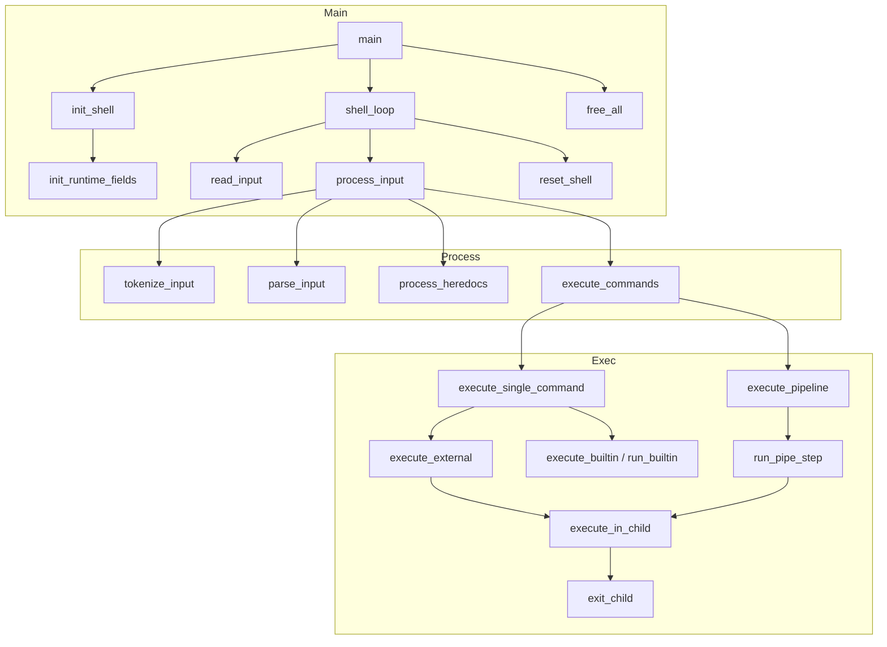

# Data Model & Function Reference

This document explains **why** we chose the current data structures and lists **every function** in the codebase with a one-line description. Use it for onboarding, refactors, and debugging. See [minishell_architecture.md](minishell_architecture.md) for flow and [BEHAVIOR.md](BEHAVIOR.md) for semantics.

---

## Part 1: Data Model (Structs & Enums)

All types live in **`includes/structs.h`**. The design follows: (1) one representation for each pipeline stage, (2) linked lists for variable-length data, (3) minimal globals.

### 1.1 Token types and parser state

| Type | Definition | Why we use it |
|------|------------|----------------|
| **`t_tokentype`** | `WORD`, `PIPE`, `REDIR_IN`, `REDIR_OUT`, `APPEND`, `HEREDOC`, `REDIR_ERR_OUT` | Same as above, plus **`REDIR_ERR_OUT`** for the `2>` operator (redirect stderr to a file). |
| **`t_state`** | `ST_NORMAL`, `ST_SQUOTE`, `ST_DQUOTE` | Quote context during tokenization. Tells us whether `$` should be expanded (only in double quotes) and when to close a quoted span. |

### 1.2 Token: `t_token`

```c
typedef struct s_token {
    t_tokentype  type;
    char        *value;   // lexeme text (e.g. "echo", ">>", "file.txt")
    int          quoted;  // 1 if from inside quotes (affects expansion / heredoc delim)
    struct s_token *next;
} t_token;
```

| Field | Purpose |
|-------|--------|
| **type** | Drives parser: WORD → argument/redir target; PIPE → new command; REDIR_* → open file / heredoc. |
| **value** | Exact string for the token. Needed for filenames, delimiters, and building `argv`. |
| **quoted** | Heredoc: quoted delimiter means no expansion in body. Expansion: single-quoted segments don’t expand `$VAR`. |
| **next** | Linked list: one pass over tokens, no random access. We only need “current + next” for syntax and parsing. |

**Why a linked list:** Input length is unknown; we emit tokens one-by-one. List is O(1) append and we only walk forward, so no need for a dynamic array.

---

### 1.3 Argument: `t_arg`

```c
typedef struct s_arg {
    char        *value;
    struct s_arg *next;
} t_arg;
```

Stores **one argument** (e.g. one element of `argv`). Commands have a variable number of arguments; we append during parsing and later convert to `char **argv` in `finalize_argv()`.

**Why not `char **args` from the start:** During parsing we add args one by one from tokens; a linked list avoids realloc and keeps `add_word_to_cmd()` simple. We build `argv` once in `argv_build.c` when the command is complete.

---

### 1.4 Redirection: `t_redir`

```c
typedef struct s_redir {
    char         *file;   // filename (heredoc delimiter lives on t_command)
    int           fd;     // dup2 target: STDIN_FILENO, STDOUT_FILENO, or STDERR_FILENO
    int           append; // 1 for >>; 0 for <, >, 2>
    struct s_redir *next;
} t_redir;
```

| Field | Purpose |
|-------|--------|
| **file** | Target filename for `<` `>` `>>` `2>`; heredoc body uses `t_command.heredoc_delim` / pipe. |
| **fd** | Which standard stream this redir replaces (`apply_one_redir` in `executor_utils.c` opens `file` and `dup2`s to `fd`). |
| **append** | For stdout: `>>` uses O_APPEND; otherwise O_TRUNC. |
| **next** | Multiple redirections per command; applied left-to-right. |

**Why a list:** Same as before—order matters; last wins per stream when chained.

**Why `fd` instead of `is_input`:** Supports **stderr** redirection (`2>`) as well as stdin/stdout without extra flags.

---

### 1.5 Command: `t_command`

```c
typedef struct s_command {
    t_arg    *args;          // linked list of argument strings
    char    **argv;         // NULL or args as array (built after parse)
    t_redir  *redirs;       // all redirections in order
    int       heredoc_fd;   // read end of pipe for << content (-1 if none)
    char     *heredoc_delim; // delimiter string for <<
    int       heredoc_quoted;// 1 = no expansion in heredoc body
    int       is_builtin;   // 1 = run in parent, 0 = fork
    struct s_command *next;
} t_command;
```

| Field | Purpose |
|-------|--------|
| **args** | Arguments collected during parse (WORD tokens). |
| **argv** | Built from `args` in `finalize_argv()`; used by executor and builtins. |
| **redirs** | File redirections `<` `>` `>>` `2>`; applied before running the command. |
| **heredoc_fd** | After `process_heredocs()`, read-end of the pipe that feeds heredoc content; -1 if no heredoc. |
| **heredoc_delim** | Delimiter for `<<`; stored here so we can read the body in `process_heredocs()`. |
| **heredoc_quoted** | If delimiter was quoted, we don’t expand variables in the heredoc body. |
| **is_builtin** | Set in `finalize_all_commands()` from `is_builtin(argv[0])`; decides run in parent vs fork. |
| **next** | Pipeline: `cmd1 | cmd2 | cmd3` → list of three commands. |

**Why both `args` and `argv`:** Parsing produces `args` incrementally; execution (and `execve`) need `argv`. One conversion step keeps parsing and execution clearly separated.

**Why heredoc in `t_command`:** Heredoc is per-command and read before execution; storing delimiter and fd on the command keeps `process_heredocs()` and `apply_redirections()` simple.

**Why `is_builtin` on the command:** So the executor can branch once (single command vs pipeline, then builtin vs external) without re-resolving the name.

---

### 1.6 Shell: `t_shell`

```c
typedef struct s_shell {
    char     **envp;            // owned copy of environment (modified by export/unset/cd)
    char      *user;            // for prompt (from USER; may be NULL if unset)
    char      *cwd;             // for prompt (from getcwd)
    int        last_exit;       // exit status of last command ($?)
    int        had_path;        // true if PATH existed at shell startup
    int        barrier_write_fd;// pipeline launch barrier FD (-1 if inactive)
    t_token   *tokens;          // result of tokenize_input()
    t_command *commands;        // result of parse_input()
    char      *input;           // current line (owned; freed after tokenize or on reset)
    int        word_quoted;     // internal tokenizer flag: current word is quoted
    int        heredoc_mode;    // internal tokenizer flag: suppress $ expansion in heredoc delim
} t_shell;
```

| Field | Purpose |
|-------|--------|
| **envp** | We own it so `export`/`unset`/`cd` can change it; passed to `execve`. |
| **user, cwd** | Prompt construction; updated by `cd`. |
| **last_exit** | Exit status of last command; used for `$?` and by `exit` with no args. |
| **had_path** | Set in `init_shell`: whether `PATH` was present at startup. Used by `find_command_path()` when resolving commands without `/` in the name. |
| **barrier_write_fd** | Write FD for the pipeline launch barrier (or -1). Children block on reading the barrier pipe until the parent releases it — reduces non-deterministic stderr ordering in pipelines. |
| **tokens** | Output of tokenizer; input to parser; freed after parse or on syntax error. |
| **commands** | Output of parser; input to heredoc + executor; freed after execution or on error. |
| **input** | Current line from `readline` (TTY) or `read_line_stdin` in `main.c` (non-TTY); freed in tokenizer or in `reset_shell()`. |
| **word_quoted** | Internal flag set by `mark_word_quoted()` during tokenization; tells `flush_word()` whether the current token came from a quoted span. |
| **heredoc_mode** | Internal flag set by `set_heredoc_mode()`; when active, the tokenizer does not expand `$` in the heredoc delimiter string. |

**Why one shell struct:** Single place for “current line’s” state (tokens, commands, input) and persistent state (env, cwd, last_exit). No global state except `g_signum` for signals.

---

### 1.7 Heredoc context: `t_heredoc_ctx`

```c
typedef struct s_heredoc_ctx {
    t_command  *cmd;        // command that owns this heredoc
    t_shell    *shell;      // shell reference (for expansion, signals)
    int         pipe_fd[2]; // pipe: write end for body, read end becomes cmd->heredoc_fd
    int         expand;     // 1 = expand $VAR in body; 0 = literal (quoted delimiter)
} t_heredoc_ctx;
```

| Field | Purpose |
|-------|--------|
| **cmd** | The command this heredoc belongs to; its `heredoc_fd` is set after reading. |
| **shell** | Needed for `expand_heredoc_line()` (variable values) and signal checking. |
| **pipe_fd** | The heredoc body is written to `pipe_fd[1]`; `pipe_fd[0]` becomes `cmd->heredoc_fd` for execution. |
| **expand** | Determined by `is_quoted_delimiter()`: if the delimiter was quoted (`'EOF'` or `"EOF"`), no expansion. |

**Why a context struct:** `read_heredoc()` and its helpers (`heredoc_read_loop`, `heredoc_interrupted`) need access to the command, shell, pipe, and expansion flag. Bundling them avoids passing 4+ parameters through the call chain (42 Norm limits functions to 4 params).

---

### 1.8 Builtin enum: `t_builtin`

```c
typedef enum e_builtin {
    NOT_BUILTIN = 0, BUILTIN_ECHO, BUILTIN_CD, BUILTIN_PWD,
    BUILTIN_EXPORT, BUILTIN_UNSET, BUILTIN_ENV, BUILTIN_EXIT
} t_builtin;
```

Used by `get_builtin_type()` / `run_builtin()` to dispatch without string comparison in the hot path. Adding a builtin = one new enum value and one case in the dispatcher.

---

### 1.9 Summary diagram

```mermaid
erDiagram
    t_shell ||--o| t_token : "tokens"
    t_shell ||--o| t_command : "commands"
    t_shell ||--o| envp : "envp"
    t_command ||--o| t_arg : "args"
    t_command ||--o| t_redir : "redirs"
    t_command --> argv : "argv (from args)"
    t_heredoc_ctx --> t_command : "cmd"
    t_heredoc_ctx --> t_shell : "shell"
    t_token --> t_token : "next"
    t_arg --> t_arg : "next"
    t_redir --> t_redir : "next"
    t_command --> t_command : "next (pipeline)"
```

---

## Part 2: Function Reference

Functions are grouped by **source file**. Each row: function name, return type / signature summary, and a short description.

### 2.1 Main & init

| File | Function | Description |
|------|----------|-------------|
| **main.c** (src/) | `main(argc, argv, envp)` | Entry point: zero shell, `init_shell()`, set signals, `shell_loop()`, then `free_all()` and return `last_exit`. |
| **main.c** (src/) | `process_input(shell)` | Runs tokenize → parse → process_heredocs → execute_commands; sets `shell->last_exit`. (static) |
| **main.c** (src/) | `read_input(shell)` | Reads one line: TTY → `build_prompt()` + `readline()`; non-TTY → `get_next_line(STDIN_FILENO)` (from libft). Returns 1=ok, 0=EOF, -1=signal. (static) |
| **main.c** (src/) | `shell_loop(shell)` | REPL: while(1) { check_signal, read_input, process_input if non-empty, reset_shell }. (static) |
| **core/init.c** | `get_env_value(envp, key)` | Returns pointer to value part of `KEY=value` in `envp`, or NULL. |
| **core/init.c** | `build_prompt(shell)` | Builds `"USER@minishell:CWD$ "` from shell->user/cwd; uses defaults if NULL. |
| **core/init.c** | `init_shell(shell, envp)` | Sets envp (dup), user (NULL-safe if no USER), cwd, `had_path`, `update_shlvl`, last_exit=0, tokens/commands/input=NULL; calls `init_runtime_fields`. |
| **core/init_runtime.c** | `init_runtime_fields(shell)` | Initializes runtime fields: `barrier_write_fd=-1`, `word_quoted=0`, `heredoc_mode=0`. Also adjusts env ordering for CI compatibility. |

---

### 2.2 Utils & memory

| File | Function | Description |
|------|----------|-------------|
| **utils/utils.c** | `ft_strcat(dest, src)` | Appends `src` to `dest` in place. |
| **utils/utils.c** | `ft_realloc(ptr, new_size)` | Reallocates buffer; copies min(old_len, new_size-1); frees old. |
| **utils/utils.c** | `ft_arrdup(envp)` | Duplicates `char**` array (for envp). |
| **utils/utils.c** | `msh_calloc(shell, nmemb, size)` | Like calloc; on failure calls `free_all(shell)` and exit. |

---

### 2.3 Tokenizer (src/tokenizer/)

| File | Function | Description |
|------|----------|-------------|
| **tokenizer/tokenizer.c** | `tokenize_input(shell)` | Main entry: tokenizer_loop over shell->input, then flush_word; frees input. |
| **tokenizer/tokenizer_utils.c** | `flush_word(shell, word, token)` | If *word non-empty, creates a WORD token and appends to *token list; frees *word. |
| **tokenizer/tokenizer_utils.c** | `mark_word_quoted(shell)` | Sets `shell->word_quoted` flag for the current word. |
| **tokenizer/tokenizer_utils.c** | `set_heredoc_mode(shell, mode)` | Sets `shell->heredoc_mode` so `$` is not expanded in delimiter. |
| **tokenizer/tokenizer_utils.c** | `is_heredoc_mode(shell)` | Returns `shell->heredoc_mode` — whether we are parsing a heredoc delimiter. |
| **tokenizer/tokenizer_utils.c** | `append_char(shell, dst, c)` | Appends one char to *dst, reallocating via msh_calloc. |
| **tokenizer/tokenizer_utils2.c** | `add_token(head, new)` | Appends token `new` to list `*head`. |
| **tokenizer/tokenizer_utils2.c** | `new_token(shell, type, value)` | Allocates a token with type and value (value is strduped). |
| **tokenizer/tokenizer_utils2.c** | `process_normal_char(shell, c, i, word)` | Appends char `c` to word and advances `*i`. |
| **tokenizer/tokenizer_handlers.c** | `handle_end_of_string(shell, state)` | At end of input: flush word, handle unclosed quotes / continuation. |
| **tokenizer/tokenizer_handlers.c** | `process_quote(shell, c, state)` | Updates quote state for `'` and `"`; returns 1 if char was quote. |
| **tokenizer/tokenizer_handlers.c** | `handle_operator(shell, i, word)` | If input at *i is operator (| < > << >>), flushes word and calls read_operator. |
| **tokenizer/tokenizer_handlers.c** | `handle_whitespace(shell, i, word)` | Skips spaces/tabs; flushes word if non-empty. |
| **tokenizer/tokenizer_handlers.c** | `handle_backslash(shell, i, word, state)` | Handles backslash escape sequences. |
| **tokenizer/tokenizer_quotes.c** | `handle_single_quote(shell, i, word, state)` | Reads single-quoted span (no expansion); appends to word. |
| **tokenizer/tokenizer_quotes.c** | `handle_double_quote(shell, i, word, state)` | Reads double-quoted span; expands `$VAR` and `$?`. |
| **tokenizer/tokenizer_ops.c** | `is_op_char(c)` | Returns 1 if c is `|`, `<`, or `>`. |
| **tokenizer/tokenizer_ops.c** | `read_operator(shell, s, list)` | Parses one operator at s, creates token, appends to list; returns 1 or 2 (chars consumed). |
| **tokenizer/expansion.c** | `expand_var(shell, i)` | Expands one variable at *i ($VAR or $?); advances *i; returns new string (caller frees). |
| **tokenizer/expansion.c** | `handle_variable_expansion(shell, i, word)` | If input at *i is `$` and expandable, expands and appends to word. |
| **tokenizer/expansion.c** | `handle_tilde_expansion(shell, i, word)` | Expands `~` to HOME and appends to word. |
| **tokenizer/expansion_utils.c** | `append_expansion_quoted(word, exp)` | Appends string `exp` to *word (quoted context). |
| **tokenizer/expansion_utils.c** | `append_expansion_unquoted(shell, word, exp, tokens)` | Appends expansion result; may split into multiple WORDs (IFS). |
| **tokenizer/expansion_utils.c** | `handle_empty_unquoted_expansion(shell, start, end, word)` | Handles empty expansion in unquoted context (inserts `MSH_EMPTY_EXPAND_TOKEN` or adjusts for ambiguous redirect). |
| **tokenizer/continuation.c** | `append_continuation(shell, s, state)` | Reads more lines (e.g. after backslash or unclosed quote) and appends to *s. |

---

### 2.4 Parser (src/parser/)

| File | Function | Description |
|------|----------|-------------|
| **parser/parser.c** | `parse_input(shell)` | Syntax check; on success parse_tokens + finalize_all_commands; on error sets last_exit=2 and frees tokens. |
| **parser/parser.c** | `is_redirection(type)` | Returns 1 if type is REDIR_IN, REDIR_OUT, APPEND, or HEREDOC. (used in parser) |
| **parser/add_token_to_cmd.c** | `add_token_to_command(shell, cmd, token)` | Dispatches token: WORD → add_word_to_cmd; HEREDOC/redirs → set delim or append_redir. Returns 1 (WORD) or 2 (redir/heredoc). |
| **parser/argv_build.c** | `finalize_all_commands(shell, cmd)` | For each command: finalize_argv then set cmd->is_builtin = is_builtin(argv[0]). |
| **parser/argv_build.c** | `finalize_argv(shell, cmd)` | Builds cmd->argv from cmd->args (NULL-terminated array). |
| **parser/parser_syntax_check.c** | `syntax_check(token)` | Validates: no leading/trailing/double pipe; every redir followed by WORD. Returns SYNTAX_OK or SYNTAX_ERR. |
| **parser/parser_syntax_check.c** | `syntax_error(msg)` | Prints "minishell: syntax error near unexpected token 'msg'" to stderr; returns SYNTAX_ERR. |

---

### 2.5 Heredoc (src/parser/)

| File | Function | Description |
|------|----------|-------------|
| **parser/heredoc.c** | `process_heredocs(shell)` | For each command with heredoc_delim, calls read_heredoc; returns 1 on SIGINT. |
| **parser/heredoc.c** | `read_heredoc(cmd, shell)` | Creates pipe, reads lines until delimiter, writes to pipe (with optional expansion); sets cmd->heredoc_fd to read end. |
| **parser/heredoc_utils.c** | `is_quoted_delimiter(delim)` | Returns 1 if delimiter is quoted (e.g. `'EOF'` or `"EOF"`) so body is not expanded. |
| **parser/heredoc_utils.c** | `expand_heredoc_line(line, shell)` | Expands `$VAR` and `$?` in line; returns new string (caller frees). |
| **parser/heredoc_warning.c** | `print_heredoc_eof_warning(line_count, delim)` | Prints bash-style "warning: here-document delimited by end-of-file" with line number. |
| **parser/heredoc_warning.c** | `write_heredoc_line(line, write_fd, expand, shell)` | Writes one heredoc line to the pipe, optionally expanding variables. |

---

### 2.6 Executor (src/executor/)

| File | Function | Description |
|------|----------|-------------|
| **executor/executor.c** | `execute_commands(shell)` | If single command → execute_single_command; else execute_pipeline. Returns exit status. |
| **executor/executor.c** | `execute_single_command(cmd, shell)` | `backup_fds` (closes partial dup on failure), apply_redirections, then execute_builtin or execute_external; restores fds; returns status. |
| **executor/executor_count.c** | `wait_pipeline(pids, n)` | Waitpids all; returns exit status of last process (bash convention). |
| **executor/executor_count.c** | `count_cmds(cmd)` | Returns number of commands in the pipeline (linked list length). |
| **executor/executor_utils.c** | `apply_redirections(cmd)` | Applies cmd->redirs in order (`r->fd` stdin/stdout/stderr); then if heredoc_fd >= 0, dup2 to stdin. Returns 0/1. |
| **executor/executor_cmd_utils.c** | `restore_fds(stdin_backup, stdout_backup)` | Restores stdin/stdout from backups and closes backups. |
| **executor/executor_cmd_utils.c** | `execute_builtin(cmd, shell)` | Calls run_builtin(cmd->argv, shell). |
| **executor/executor_cmd_utils.c** | `set_underscore(shell, path)` | Updates `_` in envp after resolving executable path (child before execve). |
| **executor/executor_external.c** | `execute_external(cmd, shell)` | Forks; child runs execute_in_child; parent waits and returns child exit status. |
| **executor/executor_external.c** | `find_command_path(cmd, shell)` | Absolute path → strdup; else search PATH from env (if missing and `had_path`, may use a built-in default list—see source). Returns path or NULL (127 for caller). |
| **executor/executor_child.c** | `exit_child(shell, status)` | Clean child exit: calls `free_all(shell)`, closes standard FDs, exits with status. |
| **executor/executor_child.c** | `free_array(arr)` | Frees each element and the array (used for PATH split). |
| **executor/executor_child_exec.c** | `execute_in_child(cmd, shell)` | In child: if builtin → `run_builtin_child`; else find path, check dir/exec, execve or exit 127/126. |
| **executor/executor_child_format.c** | `write_err3(prefix, name, msg)` | Writes 3-part error message ("prefix: name: msg") to stderr. |
| **executor/executor_child_format.c** | `format_cmd_name_for_error(name)` | Escapes special characters in command name for error display (e.g. `$'\n'` quoting). |
| **executor/executor_pipeline.c** | `execute_pipeline(cmds, shell)` | Creates pipe(s), forks each command with pipes connected, wait_pipeline, returns last exit status. |
| **executor/executor_pipeline_steps.c** | `run_pipe_step(cmd, shell, prev_fd, pipe_fd)` | Forks one pipeline step: sets up child FDs, calls `execute_in_child`. |
| **executor/executor_pipeline_steps.c** | `release_pipeline_barrier(barrier_fd, cmd_count)` | Closes barrier write FD to unblock all pipeline children simultaneously. |

---

### 2.7 Builtins & dispatcher (src/builtins/)

| File | Function | Description |
|------|----------|-------------|
| **builtins/builtin_dispatcher.c** | `get_builtin_type(cmd)` | Returns enum (BUILTIN_ECHO, etc.) or NOT_BUILTIN. |
| **builtins/builtin_dispatcher.c** | `is_builtin(cmd)` | Returns 1 if cmd is a builtin name, 0 otherwise. |
| **builtins/builtin_dispatcher.c** | `run_builtin(argv, shell)` | Dispatches to the correct builtin by name; returns builtin return value. |
| **builtins/echo.c** | `builtin_echo(args, shell)` | Prints args to stdout with spaces; handles -n (no newline). Returns 0. |
| **builtins/cd.c** | `builtin_cd(args, shell)` | Changes directory (arg or HOME); updates PWD/OLDPWD in envp; returns 0/1. |
| **builtins/pwd.c** | `builtin_pwd(args, shell)` | Prints current working directory. Returns 0. |
| **builtins/env.c** | `builtin_env(args, shell)` | Prints envp (one KEY=value per line). Returns 0. |
| **builtins/export.c** | `builtin_export(args, shell)` | No args: print declare -x list; with args: add/update env; invalid name → error, return 1. |
| **builtins/export_utils.c** | `is_valid_export_name(name)` | Returns 1 if name is valid for export (letter/underscore start, alnum/_). |
| **builtins/export_utils.c** | `find_export_key_index(shell, key, key_len)` | Finds index of `KEY=value` or bare `KEY` in envp. |
| **builtins/export_utils.c** | `append_export_env(shell, entry)` | Appends one "KEY=value" to shell->envp. |
| **builtins/export_print.c** | `print_sorted_env(shell)` | Prints env in declare -x format (sorted). |
| **builtins/unset.c** | `builtin_unset(args, shell)` | Removes listed vars from envp. Returns 0/1. |
| **builtins/exit.c** | `builtin_exit(args, shell)` | Exits shell: optional numeric status; too many args → error; non-numeric → **2** (bash: 255). Calls free_all. |
| **builtins/exit_utils.c** | `parse_exit_value(str, result)` | Parses a string as a `long long` exit value with overflow detection. Returns 0 on success, 1 on error. |

---

### 2.8 Signals & free

| File | Function | Description |
|------|----------|-------------|
| **signals/signal_handler.c** | `set_signals_default()` | Sets SIGINT/SIGQUIT/SIGTERM/SIGPIPE to SIG_DFL (for child). |
| **signals/signal_handler.c** | `set_signals_ignore()` | Sets SIGINT/SIGQUIT to SIG_IGN (parent during pipeline). |
| **signals/signal_handler.c** | `set_signals_interactive()` | SIGQUIT/SIGTERM/SIGPIPE ignored; SIGINT → sets g_signum and prints newline. |
| **signals/signal_handler.c** | `handle_child_exit(last_exit_status, pid)` | Waitpid; sets *last_exit_status from WEXITSTATUS or 128+signal. |
| **signals/signal_utils.c** | `readline_event_hook()` | Readline hook: sets g_signum on SIGINT. |
| **signals/signal_utils.c** | `check_signal_received(shell)` | If g_signum==SIGINT, sets shell->last_exit=130 and clears g_signum; returns 1 if signal was seen. |
| **free/free_utils.c** | `free_tokens(token)` | Frees entire token list and their values. |
| **free/free_utils.c** | `free_args(arg)` | Frees entire t_arg list and their values. |
| **free/free_runtime.c** | `free_commands(cmd)` | Frees command list: args, argv, redirs, heredoc_delim, and nodes. |
| **free/free_shell.c** | `reset_shell(shell)` | Frees tokens, commands, input; sets pointers to NULL (per-line cleanup). |
| **free/free_shell.c** | `free_all(shell)` | Full teardown: tokens, commands, envp, user, cwd, input. |

---

## Part 3: Call flow (high level)



---

## Related docs

| Document | Content |
|----------|---------|
| [minishell_architecture.md](minishell_architecture.md) | Pipeline stages, signals, source layout, testing. |
| [TECHNICAL_DECISIONS.md](TECHNICAL_DECISIONS.md) | What we changed and why (data, functions, defensive, 42); recent fix list. |
| [42_tester_failures.md](42_tester_failures.md) | 42 tester status and root-cause fixes. |
| [BEHAVIOR.md](BEHAVIOR.md) | Input/output semantics, exit codes, builtin behavior. |
