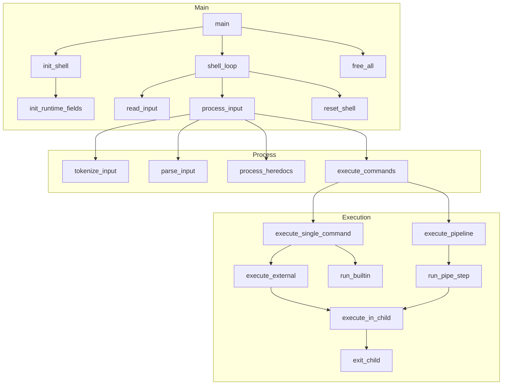

# Data Model & Function Reference

Explains **why** each data structure exists and lists **every function** with a one-line description. Use for onboarding and studying the codebase.

**Companion docs:** [MINISHELL_ARCHITECTURE.md](MINISHELL_ARCHITECTURE.md) (flow), [BEHAVIOR.md](BEHAVIOR.md) (expected I/O).

---

## Part 1: Data Model

All types in `includes/structs.h`. Design principle: one type per pipeline stage, linked lists for variable-length data, one global only (`g_signum`).

### 1.1 Enums

**`t_tokentype`** — `WORD`, `PIPE`, `REDIR_IN`, `REDIR_OUT`, `APPEND`, `HEREDOC`

Drives parser decisions: WORD -> argument/filename; PIPE -> new command; REDIR_* -> open file.

Note: numeric file-descriptor redirections (e.g. `2>`) are not supported by this
minishell. Such forms are tokenized as a separate `WORD` containing the digit
(for example `2`) followed by a `REDIR_OUT` token (`>`). Consequently,
`echo hi 2>file` is parsed as the argument `2` and an output redirection `>` to
`file` (stdout redirected), not as an stderr redirection.

**`t_state`** — `ST_NORMAL`, `ST_SQUOTE`, `ST_DQUOTE`

Quote context during tokenization. Controls whether `$` is expanded.

**`t_builtin`** — `NOT_BUILTIN`, `BUILTIN_ECHO`, `BUILTIN_CD`, `BUILTIN_PWD`, `BUILTIN_EXPORT`, `BUILTIN_UNSET`, `BUILTIN_ENV`, `BUILTIN_EXIT`

Enum dispatch in `run_builtin()` avoids repeated string comparison.

### 1.2 Token: `t_token`

```c
typedef struct s_token {
    t_tokentype  type;    // Token classification
    char        *value;   // Lexeme text ("echo", ">>", "file.txt")
    int          quoted;  // 1 if from quoted context
    t_token     *next;    // Linked list
} t_token;
```

| Field | Why |
|-------|-----|
| `type` | Parser branches on WORD vs PIPE vs REDIR_* |
| `value` | Filenames, delimiters, argv elements |
| `quoted` | Heredoc: quoted delimiter = no expansion in body. Expansion: single-quoted = no expand |
| `next` | Linked list: O(1) append, forward-only traversal |

### 1.3 Argument: `t_arg`

```c
typedef struct s_arg {
    char    *value;
    t_arg   *next;
} t_arg;
```

One argument per node. Collected during parsing, then converted to `char **argv` by `finalize_argv()`. Linked list avoids realloc during parse.

### 1.4 Redirection: `t_redir`

```c
typedef struct s_redir {
    char    *file;    // Target filename
    int      fd;      // dup2 target: STDIN_FILENO, STDOUT_FILENO, or STDERR_FILENO
    int      append;  // 1 for >> (O_APPEND), 0 for < > 2>
    t_redir *next;    // Multiple redirections per command
} t_redir;
```

| Field | Why |
|-------|-----|
| `file` | For `<` `>` and `>>`. Heredoc uses `t_command.heredoc_delim` |
| `fd` | Supports stdin, stdout, AND stderr redirection with one struct |
| `append` | `>>` uses O_APPEND; `>` uses O_TRUNC |
| `next` | Applied left-to-right; last wins per stream |

### 1.5 Command: `t_command`

```c
typedef struct s_command {
    t_arg      *args;           // Arguments during parse
    char      **argv;           // Built from args (NULL-terminated) for execve
    t_redir    *redirs;         // All redirections in order
    int         heredoc_fd;     // Read end of pipe for << content (-1 if none)
    char       *heredoc_delim;  // Delimiter string for <<
    int         heredoc_quoted; // 1 = no expansion in heredoc body
    int         is_builtin;     // 1 = run in parent; 0 = fork
    t_command  *next;           // Pipeline: cmd1 | cmd2 | cmd3
} t_command;
```

| Field | Why |
|-------|-----|
| `args` / `argv` | Parse produces `args` incrementally; execution needs `argv` array. One conversion step keeps stages separate |
| `heredoc_fd` | After `process_heredocs()`, this is the read end of a pipe containing the heredoc body |
| `heredoc_delim` | Stored so `process_heredocs()` knows what delimiter to match |
| `heredoc_quoted` | If delimiter was `'EOF'` or `"EOF"`, body is not expanded |
| `is_builtin` | Set once in `finalize_all_commands()` so executor doesn't re-check |
| `next` | Pipeline: `ls | grep | wc` = 3 linked commands |

Note: this implementation stores only a single `heredoc_delim` per
`t_command`. If the user writes multiple `<<` operators on the same command
(for example `cat << EOF1 << EOF2`), earlier delimiters are overwritten and
only the last heredoc delimiter is processed by `process_heredocs()`. Bash
reads all here-document bodies before executing the command; this minishell
only reads the final one (intentional simplification to keep the parser
and command model simpler).

### 1.6 Shell: `t_shell`

```c
typedef struct s_shell {
    char      **envp;           // Owned copy of environment
    char       *user;           // For prompt (from USER)
    char       *cwd;            // For prompt (from getcwd)
    int         last_exit;      // Exit status of last command ($?)
    int         had_path;       // PATH existed at startup
    int         barrier_write_fd; // Pipeline launch barrier FD (-1 if inactive)
    t_token    *tokens;         // Tokenizer output
    t_command  *commands;       // Parser output
    char       *input;          // Current line from readline/stdin
    int         word_quoted;    // Tokenizer flag: current word is quoted
    int         heredoc_mode;   // Tokenizer flag: suppress $ in heredoc delim
    int         stdin_backup;   // Saved stdin FD during single-command execution
    int         stdout_backup;  // Saved stdout FD during single-command execution
} t_shell;
```

| Field | Why |
|-------|-----|
| `envp` | Owned copy so `export`/`unset`/`cd` can modify it; passed to `execve` |
| `user`, `cwd` | Prompt construction; `cwd` updated by `cd` |
| `last_exit` | `$?` expansion and `exit` with no args |
| `had_path` | If PATH was present at startup; affects command resolution |
| `barrier_write_fd` | Pipeline launch barrier: children block until parent closes this FD |
| `tokens` | Output of tokenizer; freed after parse |
| `commands` | Output of parser; freed after execution |
| `input` | Current line; freed in `reset_shell()` |
| `word_quoted` | Set by `mark_word_quoted()` so `flush_word()` marks the token |
| `heredoc_mode` | Set by `set_heredoc_mode()` to prevent `$` expansion in heredoc delimiter |
| `stdin_backup`, `stdout_backup` | Saved FDs for single-command redirection restore |

### 1.7 Summary Diagram

```mermaid
erDiagram
    t_shell ||--o| t_token : "tokens"
    t_shell ||--o| t_command : "commands"
    t_shell ||--o| envp : "envp"
    t_command ||--o| t_arg : "args"
    t_command ||--o| t_redir : "redirs"
    t_command --> argv : "argv (from args)"
    t_token --> t_token : "next"
    t_arg --> t_arg : "next"
    t_redir --> t_redir : "next"
    t_command --> t_command : "next (pipeline)"
```

---

## Part 2: Function Reference

Grouped by source file. Static helpers are included for completeness.

### 2.1 Main & Core

| File | Function | Static? | Description |
|------|----------|---------|-------------|
| **main.c** | `main(argc, argv, envp)` | | Entry point: init, signals, REPL, cleanup |
| **main.c** | `shell_loop(shell)` | yes | REPL: check signals, read, process, reset |
| **main.c** | `read_input(shell)` | yes | Read one line; returns 1=ok, 0=EOF, -1=signal |
| **main.c** | `read_line_stdin(shell)` | yes | Read from non-TTY stdin byte-by-byte |
| **main.c** | `process_input(shell)` | yes | Tokenize -> parse -> heredocs -> execute |
| **core/init.c** | `init_shell(shell, envp)` | | Dup env, set user/cwd/SHLVL/OLDPWD/had_path |
| **core/init.c** | `get_env_value(envp, key)` | | Return pointer to value of KEY=value in envp |
| **core/init.c** | `build_prompt(shell)` | | Allocate "user@minishell:cwd$ " prompt string |
| **core/init.c** | `update_shlvl(shell)` | yes | Increment or set SHLVL in envp |
| **core/init_runtime.c** | `init_runtime_fields(shell)` | | Close inherited FDs, init transient fields |
| **core/init_runtime.c** | `close_inherited_fds()` | yes | Close FDs 3+ from parent |

### 2.2 Utils & Memory

| File | Function | Static? | Description |
|------|----------|---------|-------------|
| **utils/utils.c** | `ft_strcat(dest, src)` | | Append src to dest in place |
| **utils/utils.c** | `ft_realloc(ptr, new_size)` | | Realloc for C-strings; copies and frees old |
| **utils/utils.c** | `msh_calloc(shell, nmemb, size)` | | Calloc with fatal exit on failure |
| **utils/utils.c** | `ft_arrdup(envp)` | | Duplicate NULL-terminated string array |
| **utils/utils.c** | `ft_arrdup_cleanup(copy, i)` | yes | Free partially built array on error |

### 2.3 Tokenizer

| File | Function | Static? | Description |
|------|----------|---------|-------------|
| **tokenizer/tokenizer.c** | `tokenize_input(shell)` | | Main entry: scan input, build token list |
| **tokenizer/tokenizer.c** | `tokenizer_loop(shell, i, state, word)` | yes | Character-by-character loop |
| **tokenizer/tokenizer.c** | `handle_quotes_and_expand(shell, i, word, state)` | yes | Dispatch quote/expansion handling |
| **tokenizer/tokenizer_utils.c** | `flush_word(shell, word, token)` | | Finalize accumulated word into WORD token |
| **tokenizer/tokenizer_utils.c** | `append_char(shell, dst, c)` | | Append char to dynamically growing string |
| **tokenizer/tokenizer_utils.c** | `mark_word_quoted(shell)` | | Set `shell->word_quoted` flag |
| **tokenizer/tokenizer_utils.c** | `set_heredoc_mode(shell, mode)` | | Set `shell->heredoc_mode` flag |
| **tokenizer/tokenizer_utils.c** | `is_heredoc_mode(shell)` | | Return `shell->heredoc_mode` |
| **tokenizer/tokenizer_utils2.c** | `new_token(shell, type, value)` | | Allocate and init token node |
| **tokenizer/tokenizer_utils2.c** | `add_token(head, new)` | | Append token to linked list |
| **tokenizer/tokenizer_utils2.c** | `process_normal_char(shell, c, i, word)` | | Append char and advance index |
| **tokenizer/tokenizer_handlers.c** | `handle_end_of_string(shell, state)` | | Handle EOS: flush word, handle unclosed quotes |
| **tokenizer/tokenizer_handlers.c** | `process_quote(shell, c, state)` | | Handle quote state transitions |
| **tokenizer/tokenizer_handlers.c** | `handle_operator(shell, i, word)` | | Detect and emit operator tokens |
| **tokenizer/tokenizer_handlers.c** | `handle_whitespace(shell, i, word)` | | Skip spaces, flush word |
| **tokenizer/tokenizer_handlers.c** | `handle_backslash(shell, i, word, state)` | | Handle backslash escapes |
| **tokenizer/tokenizer_quotes.c** | `handle_single_quote(shell, i, word, state)` | | Process single-quoted content (literal) |
| **tokenizer/tokenizer_quotes.c** | `handle_double_quote(shell, i, word, state)` | | Process double-quoted content (expand $) |
| **tokenizer/tokenizer_ops.c** | `is_op_char(c)` | | Check if char starts an operator |
| **tokenizer/tokenizer_ops.c** | `read_operator(shell, s, list)` | | Parse operator token, return width |
| **tokenizer/expansion.c** | `expand_var(shell, i)` | | Expand $VAR or $?; return new string |
| **tokenizer/expansion.c** | `expand_special_var(shell, i)` | yes | Expand $? and special variables |
| **tokenizer/expansion.c** | `expand_normal_var(shell, i)` | yes | Expand normal env variable |
| **tokenizer/expansion.c** | `handle_variable_expansion(shell, i, word)` | | Handle $ expansion in tokenizer |
| **tokenizer/expansion.c** | `handle_tilde_expansion(shell, i, word)` | | Expand ~ to HOME |
| **tokenizer/expansion_utils.c** | `append_expansion_quoted(word, exp)` | | Append expansion (no word split) |
| **tokenizer/expansion_utils.c** | `append_expansion_unquoted(shell, word, exp)` | | Append expansion with word splitting |
| **tokenizer/continuation.c** | `append_continuation(shell, s, state)` | | Read continuation line for unclosed quotes |
| **tokenizer/continuation.c** | `read_stdin_line(shell)` | yes | Read line from non-TTY stdin |
| **tokenizer/continuation.c** | `read_continuation_line(shell, quote)` | yes | Read continuation with quote prompt |
| **tokenizer/continuation.c** | `ensure_trailing_newline(shell, s, len)` | yes | Ensure string ends with newline |
| **tokenizer/continuation.c** | `append_to_input(shell, s, cont)` | yes | Append continuation to input |

### 2.4 Parser

| File | Function | Static? | Description |
|------|----------|---------|-------------|
| **parser/parser.c** | `parse_input(shell)` | | Syntax check, parse tokens, finalize commands |
| **parser/parser.c** | `is_redirection(type)` | | Check if token type is redirection |
| **parser/parser.c** | `new_command(shell)` | yes | Allocate and init command node |
| **parser/parser.c** | `parse_tokens(shell, token)` | yes | Build command list from token list |
| **parser/parser.c** | `consume_command_tokens(shell, cmd, token)` | yes | Process tokens for one command |
| **parser/parser_syntax_check.c** | `syntax_check(token)` | | Validate pipe and redir syntax |
| **parser/parser_syntax_check.c** | `syntax_error(msg)` | | Print syntax error, return SYNTAX_ERR |
| **parser/parser_syntax_check.c** | `get_token_str(type)` | yes | Get printable string for token type |
| **parser/parser_syntax_check.c** | `check_redir_syntax(token)` | yes | Validate redir followed by WORD |
| **parser/parser_syntax_check.c** | `is_redirection(type)` | yes | Internal redirection check |
| **parser/add_token_to_cmd.c** | `add_token_to_command(shell, cmd, token)` | | Route token: WORD/REDIR/HEREDOC |
| **parser/add_token_to_cmd.c** | `add_word_to_cmd(shell, cmd, word, quoted)` | yes | Append word as argument |
| **parser/add_token_to_cmd.c** | `append_redir(cmd, file, fd, append)` | yes | Create and append redir node |
| **parser/add_token_to_cmd.c** | `handle_heredoc_token(cmd, token)` | yes | Store heredoc delimiter |
| **parser/argv_build.c** | `finalize_all_commands(shell, cmd)` | | Build argv, mark builtins for all commands |
| **parser/argv_build.c** | `finalize_argv(shell, cmd)` | | Convert args list to argv array |

### 2.5 Heredoc

| File | Function | Static? | Description |
|------|----------|---------|-------------|
| **parser/heredoc.c** | `process_heredocs(shell)` | | Process all heredocs in command list |
| **parser/heredoc.c** | `read_heredoc(cmd, shell)` | | Create pipe, read heredoc body |
| **parser/heredoc.c** | `heredoc_read_loop(cmd, shell, pipe_fd, expand)` | yes | Read lines until delimiter |
| **parser/heredoc.c** | `read_heredoc_line(shell)` | yes | Read single heredoc line |
| **parser/heredoc.c** | `write_heredoc_line(line, fd, expand, shell)` | yes | Write line to pipe with optional expansion |
| **parser/heredoc_utils.c** | `expand_heredoc_line(line, shell)` | | Expand $VAR in heredoc line |
| **parser/heredoc_utils.c** | `is_quoted_delimiter(delim)` | | Check if delimiter is quoted |
| **parser/heredoc_utils.c** | `expand_heredoc_var(line, i, shell)` | yes | Expand single variable in heredoc |

### 2.6 Executor

| File | Function | Static? | Description |
|------|----------|---------|-------------|
| **executor/executor.c** | `execute_commands(shell)` | | Entry: single command or pipeline |
| **executor/executor.c** | `execute_single_command(cmd, shell)` | | Execute non-pipeline command |
| **executor/executor.c** | `backup_fds(in, out)` | yes | Dup stdin/stdout for later restore |
| **executor/executor.c** | `run_empty_command(cmd, in, out)` | yes | Handle command with no argv |
| **executor/executor.c** | `run_builtin_command(cmd, shell, in, out)` | yes | Run builtin with redir restore |
| **executor/executor_utils.c** | `apply_redirections(cmd)` | | Apply all redirections + heredoc FD |
| **executor/executor_utils.c** | `print_redir_error(file, err)` | yes | Print redirection error |
| **executor/executor_utils.c** | `apply_input_redir(r, had_input)` | yes | Open file, dup2 to stdin |
| **executor/executor_utils.c** | `apply_output_redir(r)` | yes | Open/create file, dup2 to target FD |
| **executor/executor_utils.c** | `apply_one_redir(r, had_input)` | yes | Apply single redir, detect ambiguous |
| **executor/executor_cmd_utils.c** | `restore_fds(stdin_backup, stdout_backup)` | | Restore stdin/stdout from backups |
| **executor/executor_cmd_utils.c** | `execute_builtin(cmd, shell)` | | Call run_builtin(cmd->argv, shell) |
| **executor/executor_cmd_utils.c** | `set_underscore(shell, path)` | | Set _ env var to executed path |
| **executor/executor_external.c** | `execute_external(cmd, shell)` | | Fork, exec, wait, return status |
| **executor/executor_external.c** | `find_command_path(cmd, shell)` | | Resolve command name to full path |
| **executor/executor_external.c** | `get_child_status(status)` | yes | Convert waitpid status to exit code |
| **executor/executor_external.c** | `search_in_path(paths, cmd)` | yes | Search PATH dirs for executable |
| **executor/executor_external.c** | `is_regular_file(path)` | yes | Check if path is regular file |
| **executor/executor_child.c** | `exit_child(shell, status)` | | Cleanup and exit child process |
| **executor/executor_child_exec.c** | `execute_in_child(cmd, shell)` | | Execute command in child (builtin or execve) |
| **executor/executor_child_exec.c** | `run_builtin_child(cmd, shell)` | yes | Run builtin in child, then exit |
| **executor/executor_child_exec.c** | `check_is_dir(shell, cmd, path)` | yes | Exit 126 if path is directory |
| **executor/executor_child_exec.c** | `handle_exec_error(shell, cmd, path)` | yes | Handle execve failure |
| **executor/executor_child_exec.c** | `cmd_not_found(shell, cmd)` | yes | Print error, exit 127 |
| **executor/executor_child_format.c** | `write_err3(a, b, c)` | | Write 3-part error to stderr |
| **executor/executor_child_format.c** | `format_cmd_name_for_error(name)` | | Escape special chars for error display |
| **executor/executor_child_format.c** | `write_err_line(msg)` | yes | Write error line to stderr |
| **executor/executor_child_format.c** | `needs_dollar_quote(name)` | yes | Check for unprintable chars |
| **executor/executor_child_format.c** | `append_escaped_char(out, j, c)` | yes | Append escaped char in $'...' format |
| **executor/executor_pipeline.c** | `execute_pipeline(cmds, shell)` | | Execute multi-command pipeline |
| **executor/executor_pipeline.c** | `run_pipeline_loop(cmd, shell, last_pid, sync_fd)` | yes | Fork each pipeline stage |
| **executor/executor_pipeline.c** | `setup_pipeline_barrier(shell, sync_fd)` | yes | Create sync pipe |
| **executor/executor_pipeline.c** | `close_pipeline_barrier(shell, sync_fd, n)` | yes | Release barrier, close FDs |
| **executor/executor_pipeline.c** | `wait_children_last(last_pid, n)` | yes | Wait for children, return last status |
| **executor/executor_pipeline_steps.c** | `run_pipe_step(cmd, shell, prev_fd, sync_fd)` | | Fork single pipeline stage |
| **executor/executor_pipeline_steps.c** | `release_pipeline_barrier(write_fd, count)` | | Close barrier to unblock children |
| **executor/executor_pipeline_steps.c** | `setup_child_fds(prev_fd, pipe_fd, has_next, barrier_fd)` | yes | Setup stdin/stdout for child |
| **executor/executor_pipeline_steps.c** | `fork_pipeline_cmd(cmd, shell, prev_fd, pipe_fd)` | yes | Fork and execute pipeline child |
| **executor/executor_count.c** | `wait_pipeline(pids, n)` | | Wait for pipeline children |
| **executor/executor_count.c** | `count_cmds(cmd)` | | Count commands in pipeline |

### 2.7 Builtins

| File | Function | Static? | Description |
|------|----------|---------|-------------|
| **builtins/builtin_dispatcher.c** | `get_builtin_type(cmd)` | | Map name to builtin enum |
| **builtins/builtin_dispatcher.c** | `is_builtin(cmd)` | | Check if name is builtin |
| **builtins/builtin_dispatcher.c** | `run_builtin(argv, shell)` | | Dispatch to builtin function |
| **builtins/echo.c** | `builtin_echo(args, shell)` | | Echo with -n support |
| **builtins/echo.c** | `check_n_flag(arg)` | yes | Check if arg is -n flag |
| **builtins/echo.c** | `print_args(args, start)` | yes | Print args with spaces |
| **builtins/cd.c** | `builtin_cd(args, shell)` | | Change directory |
| **builtins/cd.c** | `get_cd_target(args, shell, print)` | yes | Determine target dir |
| **builtins/cd.c** | `set_env_entry(shell, key, value)` | yes | Set env var |
| **builtins/cd.c** | `update_shell_cwd(shell, old_pwd)` | yes | Update PWD/OLDPWD/cwd |
| **builtins/cd.c** | `do_chdir(target, old_pwd)` | yes | Execute chdir |
| **builtins/pwd.c** | `builtin_pwd(args, shell)` | | Print working directory |
| **builtins/env.c** | `builtin_env(args, shell)` | | Print environment |
| **builtins/export.c** | `builtin_export(args, shell)` | | List or set env vars |
| **builtins/export.c** | `replace_or_append(shell, arg, key)` | yes | Replace or add env entry |
| **builtins/export.c** | `export_no_value(shell, arg)` | yes | Handle name-only export |
| **builtins/export.c** | `handle_append(shell, key, eq)` | yes | Handle += export |
| **builtins/export.c** | `set_env_var(shell, arg)` | yes | Parse and set var |
| **builtins/export_utils.c** | `is_valid_export_name(name)` | | Validate identifier |
| **builtins/export_utils.c** | `find_export_key_index(shell, key, len)` | | Find env index by key |
| **builtins/export_utils.c** | `append_export_env(shell, entry)` | | Append to envp array |
| **builtins/export_print.c** | `print_sorted_env(shell)` | | Print sorted env in export format |
| **builtins/export_print.c** | `print_export_entry(entry)` | yes | Print single `export KEY="value"` line |
| **builtins/export_print.c** | `cmp_env_keys(a, b)` | yes | Compare env keys for sort |
| **builtins/export_print.c** | `sort_env(sorted, count)` | yes | Bubble sort env array |
| **builtins/unset.c** | `builtin_unset(args, shell)` | | Remove env vars |
| **builtins/unset.c** | `is_valid_unset_name(name)` | yes | Validate identifier |
| **builtins/unset.c** | `find_env_index(shell, key)` | yes | Find env entry |
| **builtins/unset.c** | `remove_env_entry(shell, idx)` | yes | Remove and shift array |
| **builtins/unset.c** | `unset_one_arg(arg, shell)` | yes | Unset single var |
| **builtins/exit.c** | `builtin_exit(args, shell)` | | Exit with status |
| **builtins/exit.c** | `clean_exit(shell, code)` | yes | Cleanup and exit process |
| **builtins/exit.c** | `parse_exit_value(str, value)` | | Parse exit code string to long long |

### 2.8 Signals & Free

| File | Function | Static? | Description |
|------|----------|---------|-------------|
| **signals/signal_handler.c** | `set_signals_interactive()` | | SIGINT -> handler; ignore SIGQUIT/SIGTERM/SIGPIPE |
| **signals/signal_handler.c** | `set_signals_ignore()` | | Ignore SIGINT/SIGQUIT (parent during pipeline) |
| **signals/signal_handler.c** | `set_signals_default()` | | Default handlers (child before execve) |
| **signals/signal_handler.c** | `handle_child_exit(last_exit, pid)` | | Wait for child, compute exit status |
| **signals/signal_handler.c** | `interactive_sigint_handler(signum)` | yes | Set g_signum on SIGINT |
| **signals/signal_utils.c** | `readline_event_hook()` | | Readline hook for SIGINT handling |
| **signals/signal_utils.c** | `check_signal_received(shell)` | | Check and consume pending SIGINT |
| **free/free_utils.c** | `free_tokens(token)` | | Free token linked list |
| **free/free_utils.c** | `free_args(arg)` | | Free arg linked list |
| **free/free_utils.c** | `free_array(arr)` | | Free NULL-terminated string array |
| **free/free_runtime.c** | `free_commands(cmd)` | | Free command list and sub-structures |
| **free/free_runtime.c** | `free_argv(argv)` | yes | Free argv array |
| **free/free_runtime.c** | `free_out_redirs(r)` | yes | Free redir linked list |
| **free/free_shell.c** | `reset_shell(shell)` | | Free tokens/commands/input per line |
| **free/free_shell.c** | `free_all(shell)` | | Full teardown at exit |
| **free/free_shell.c** | `free_envp(envp)` | yes | Free environment array |

---

## Part 3: Call Flow


