# Minishell Project Architecture (Defensive Programming)

> **Philosophy:** Defensive programming means we validate every input, handle every error case explicitly, and never assume success. We use bash as our reference implementation but only implement what the 42 subject requires.
>
> **Test-backed behavior:** Primary harness is **[LeaYeh/42_minishell_tester](https://github.com/LeaYeh/42_minishell_tester)** (`tester.sh`, mandatory mode `m`). For expected I/O and exit codes, see **[BEHAVIOR.md](BEHAVIOR.md)**.
>
> **Figures (Mermaid):** §0.1 (harness), §0.3 (source graph), §0.4 (input→execute gate), §1.4 (Ctrl+C sequence), §2 (REPL), §3.2.1 (tokenizer loop), §4.1 (expansion vs heredoc), §5.2 (`parse_input` + token walk), §6.2 (heredoc), §7.1 / §7.2 / §7.5 (executor), §8.2 (`last_exit` writers).

---

## 0. Project Status & Built Implementation

This section reflects the **actual codebase** as built: source layout, data flow, and test status.

### 0.1 Test harness (current repo)

| Where | What runs | Notes |
|-------|-----------|--------|
| **Local (Docker)** | `./scripts/run_minishell_tester.sh [mode]` | Clones [LeaYeh/42_minishell_tester](https://github.com/LeaYeh/42_minishell_tester) into the dev container (`/root/42_minishell_tester`), builds `/app`, then `tester.sh --no-update <mode>`. Default mode `m` = mandatory. Common: `m`, `vm`, `b`, `ne`, `a`, `va` (see script header). |
| **GitHub Actions** | `.github/workflows/test.yaml` + `regression_test.yaml` | Same upstream: `git clone https://github.com/LeaYeh/42_minishell_tester.git`. Regression matrix: `m` (mandatory), `b` (bonus), `ne` (empty env). Crash: `a` / `a --no-env`. Valgrind: one job per `cmds/**/*.sh` with `tester.sh va`. |
| **Optional wrapper** | `make -C tests test` | Documented in [README.md](../README.md) if a `tests/` Makefile is present; not required if you only use the Docker script. |

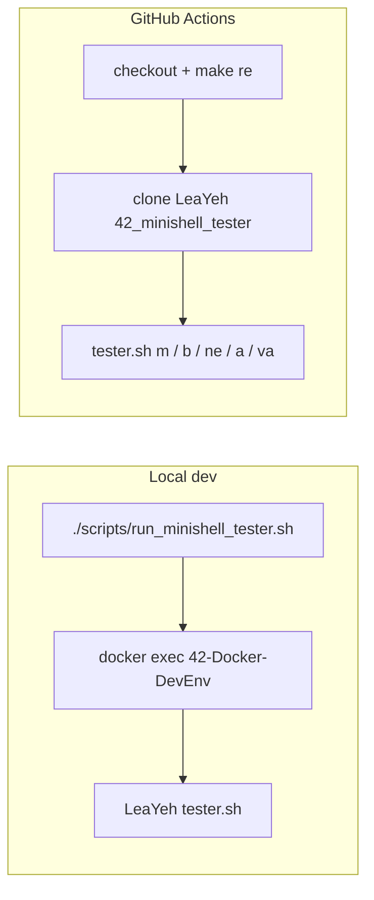

Pass/fail is **not** pinned here (depends on branch and last CI run). Use workflow logs or `mstest_output_*` from the tester for results.

### 0.2 Test coverage map (LeaYeh `cmds/mand/`)

Script names below match **[LeaYeh/42_minishell_tester](https://github.com/LeaYeh/42_minishell_tester)** (mandatory part). Behavior detail stays in [BEHAVIOR.md](BEHAVIOR.md).

| Area | Scripts (indicative) |
|------|----------------------|
| **Echo** | `1_builtins_echo.sh` |
| **pwd** | `1_builtins_pwd.sh` |
| **cd** | `1_builtins_cd.sh` |
| **env** | `1_builtins_env.sh` |
| **export** | `1_builtins_export.sh` |
| **unset** | `1_builtins_unset.sh` |
| **exit** | `1_builtins_exit.sh` |
| **Variables / expansion** | `1_variables.sh`, `11_expansion.sh`, plus parsing/compare scripts |
| **Redirections** | `1_redirs.sh` |
| **Pipes** | `1_pipelines.sh` |
| **Syntax** | `8_syntax_errors.sh` |
| **Path / 127 / 126 / stress** | `1_scmds.sh`, `2_path_check.sh`, `9_go_wild.sh` |
| **Parsing / compare** | `0_compare_parsing.sh`, `10_parsing_hell.sh` |
| **Misc correction-style** | `2_correction.sh` |

### 0.3 Source Layout (real files)

**Rule:** Only `main.c` lives in `src/` root. All other sources are in subfolders.

| Directory | Purpose |
|-----------|---------|
| `src/` | `main.c` only — REPL loop, read_input, process_input |
| `src/core/` | `init.c` (`init_shell`, `process_input`), `init_runtime.c` (`init_runtime_fields`), `init_utils.c` (`init_shell_identity`, `get_env_value`, `build_prompt`) |
| `src/utils/` | `ft_strcat`, `ft_arrdup`, `ft_realloc`, `msh_string` (lexer/expansion char helpers) |
| `src/free/` | Memory cleanup: `free_utils.c`, `free_runtime.c`, `free_shell.c` |
| `src/signals/` | Signal handlers and readline hook |
| `src/tokenizer/` | Lexer: tokenizer.c, expansion, quote/operator handlers, utils |
| `src/parser/` | Parser: parser.c, syntax_check, argv_build, heredoc, heredoc_utils, heredoc_warning |
| `src/executor/` | `executor.c`, `executor_redir_apply.c`, `executor_external.c`, `executor_pip.c`, `executor_pip_steps.c`, `executor_pip_not_found.c`, `executor_child_exec.c`, `executor_child_format.c` |
| `src/builtins/` | Builtin commands and dispatcher, export_print, exit_utils |

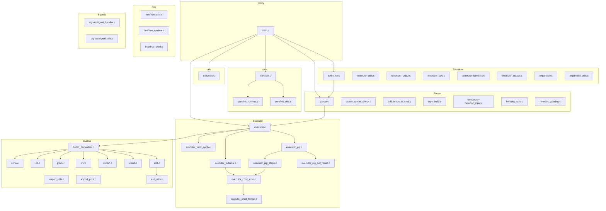

### 0.4 Pipeline: Input → Execution (real flow)

**Gate:** **`tokenize_input` → … → `execute_commands`** run only when **`shell_loop`** calls **`process_input`**, i.e. when **`shell->input[0] != '\0'`** (see **§2**). Empty lines skip this entire chain; **`reset_shell`** still runs.

```mermaid
flowchart LR
    A[readline / read_line_stdin] --> Q{input[0]?}
    Q -->|no| R[reset_shell]
    Q -->|yes| B[tokenize_input]
    B --> C[parse_input]
    C --> D[process_heredocs]
    D --> E[execute_commands]
    E --> R
    B -.-> T[(tokens)]
    C -.-> H[(commands)]
    E -.-> I[empty / builtin / external / pipeline → child or parent]
```

- **main.c** (src/): `shell_loop` → `check_signal_received` → `read_input` → if **`shell->input[0]`** then `process_input` (tokenize → parse → heredocs → execute) → `reset_shell`; non-TTY may **`break`** on syntax error (see **§2**).
- **Tokenizer** (src/tokenizer/): `tokenize_input()` in `tokenizer.c`; uses `tokenizer_handlers.c`, `tokenizer_quotes.c`, `expansion.c`, and `tokenizer_ops.c`.
- **Parser** (src/parser/): `parse_input()` in `parser.c`; `syntax_check()` in `parser_syntax_check.c`; `finalize_all_commands()` in `argv_build.c` builds `argv` and sets `is_builtin`.
- **Executor** (src/executor/): `execute_commands()` in `executor.c` — empty argv, `run_empty_command`; else single command: `run_builtin_command` (parent with optional `dup`/`apply_redirections`/`restore_fds`, or `execute_external` if builtin has redirs and is not `must_run_in_parent`) or `execute_external`; pipeline → `execute_pipeline()` → `run_pipe_step` / `wait_children_last`; child path → `execute_in_child()` in `executor_child_exec.c`.

---

## 1. Global State & Signal Handling

### 1.1 The only global: `g_signum`

```c
/* signals/signal_handler.c — ONLY global in the project */
volatile sig_atomic_t	g_signum = 0;
```

| `g_signum` | Meaning |
| ---------- | ------- |
| `0` | No signal pending |
| `SIGINT` | Ctrl+C seen by handler; cleared after `check_signal_received()` or when the readline hook consumes it |

**`last_exit = EXIT_SIGINT`:** Set in **`check_signal_received()`** (`signal_utils.c`). **`EXIT_SIGINT`** is **`EXIT_STATUS_FROM_SIGNAL(SIGINT)`** in **`includes/defines.h`** (typically **130**). The async handler does **not** set `t_shell->last_exit`.

**Rules:** No structs/pointers in globals; **never** use `t_shell` inside a handler. The SIGINT handler only sets **`g_signum`** and **`write(STDOUT_FILENO, "\n", 1)`** (async-signal-safe).

**Why `volatile sig_atomic_t`:** The compiler must reload the value; writes from the handler must be atomic.

### 1.2 Bash-oriented behavior (user-visible)

| Signal / input | At prompt (interactive) | While external/pipeline child runs | During heredoc input |
| -------------- | ------------------------ | ----------------------------------- | -------------------- |
| **SIGINT** (Ctrl+C) | New line, `$? = EXIT_SIGINT` (usually 130), new prompt | Child receives default SIGINT; parent ignores while in **`waitpid`** | Loop stops, `process_input` sets **`EXIT_SIGINT`** (see §6) |
| **SIGQUIT** (Ctrl+\) | Ignored (`SIG_IGN`) | Child: default → may print “Quit (core dumped)” | Ignored |
| **EOF** (Ctrl+D) | `readline` returns NULL → exit shell | N/A | Line ends / EOF handling in **`read_heredoc_line`** |

See **[BEHAVIOR.md](BEHAVIOR.md)** for tables and tester-oriented notes (e.g. SIGPIPE / stderr on Linux).

### 1.3 Interactive installation (`set_signals_interactive`)

**Call site:** `main()` after `init_shell()` (`signal_handler.c`).

| Signal | Action |
| ------ | ------ |
| **SIGINT** | `interactive_sigint_handler`, **`SA_RESTART`**, **`sa_mask`** includes **SIGQUIT** (no re-entrancy race on Ctrl+\) |
| **SIGQUIT** | `SIG_IGN` |
| **SIGTERM** | `SIG_IGN` |
| **SIGPIPE** | `SIG_IGN` (children inherit; common on Linux systemd sessions) |

**TTY + readline:** `main()` sets **`rl_event_hook = readline_event_hook`**. While readline is active, the hook sees **`g_signum == SIGINT`**, clears the line, **`rl_on_new_line()`**, **`rl_done = 1`**, so readline returns.

### 1.4 Ctrl+C at the prompt (control flow)

1. Handler: **`g_signum = SIGINT`**, **`write(1, "\n", 1)`**.
2. **`readline_event_hook`**: discard buffer, end readline.
3. **`read_input()`** calls **`check_signal_received(shell)`**: **`last_exit = EXIT_SIGINT`**, **`g_signum = 0`**, return **`-1`** → **`shell_loop`** **`continue`** (no `process_input` on that line).
4. **`shell_loop`** also calls **`check_signal_received`** at the **start** of each iteration.

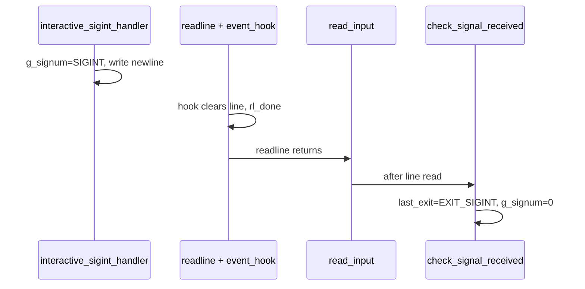

### 1.5 Dispositions around `fork` / `wait`

| Phase | Function | Effect |
| ----- | -------- | ------ |
| Child after **`fork`** | **`set_signals_default`** | SIGINT, SIGQUIT, SIGPIPE, SIGTERM → **default** (`executor_external.c`, **`executor_pip_steps.c`**) |
| Parent while waiting | **`set_signals_ignore`** | SIGINT, SIGQUIT → **ignore** so the waiting parent is not torn down by the same keystroke |
| After wait returns | **`set_signals_interactive`** | Restore §1.3 |

**Pipeline:** **`execute_pipeline`** calls **`set_signals_ignore`**, runs **`run_pipeline_loop`**, **`wait_children_last`**, then **`set_signals_interactive`**. **Single external:** same pattern inside **`execute_external`** around **`waitpid`**.

### 1.6 `t_shell` (no further globals)

All other state is in **`t_shell`** (`includes/structs.h`). **Env, cwd, tokens, commands, input:** filled by init/parser/lexer. **Extra fields:**

- **`had_path`:** PATH was present when the shell started (PATH resolution).
- **`barrier_write_fd`:** optional pipeline sync write FD, or **`-1`**.
- **`word_quoted` / `heredoc_mode`:** tokenizer flags (quoted WORD; no `$` in `<<` delimiter).

Full **init** order: **§0.3** (`init_shell` / `init_runtime_fields`).

---

## 2. Main Loop (REPL Cycle)

**Implementation:** `src/main.c` → **`shell_loop()`** → **`read_input()`** → (optional) **`process_input()`** in `src/core/init.c`.

**Input source:** When stdin is a **TTY**, `read_input()` uses **`readline(prompt)`** after **`build_prompt(shell)`** (history, line editing). When stdin is **not** a TTY (e.g. **42_minishell_tester**), it uses **`read_line_stdin()`** (static in `main.c`): **`read(STDIN_FILENO, &c, 1)`** until **`'\n'`** or **EOF**—no prompt, no readline. The returned string **does not** include the newline. If **EOF** is read after at least one character without a newline, that partial line is still returned (then the next call may get **EOF** on an empty buffer → **`NULL`**, same as clean EOF on an empty line).

**`read_input()` return values** (only `shell_loop` sees these):

| Return | Meaning | `shell_loop` action |
|--------|---------|---------------------|
| **0** | **EOF** (`NULL` from readline / stdin path) | **TTY:** prints **`exit\n`** then **`break`**. **Non-TTY:** **`break`** without printing. |
| **-1** | **SIGINT** path: **`check_signal_received()`** inside `read_input` fired; **`shell->input`** freed and cleared | **`continue`** (no `process_input`, no `reset_shell` for that iteration—nothing to free beyond what `read_input` already did). |
| **1** | A non-**NULL** line was read | If **`shell->input[0] != '\0'`** → **`process_input(shell)`**; if the first byte is **`'\0'`** → skip **`process_input`** entirely (empty line: no tokenize, no history). Then **`reset_shell(shell)`** always runs. |

**Inside `read_input()`** (after a line pointer is obtained): **`check_signal_received(shell)`** runs for **every** non-**NULL** line (**empty** `""` included) before returning **1**—same mechanism as Ctrl+C at the prompt (§1.4). **`build_prompt()`** failure returns **0** (loop exits as if EOF).

**After `process_input()`** (when it was called): **`shell_loop`** sets **`syntax_err = 1`** if **`!shell->commands && shell->last_exit == EXIT_SYNTAX_ERROR`** (e.g. unclosed quote from tokenizer). **`reset_shell()`** still runs. If **stdin is not a TTY** and **`syntax_err`**, the loop **`break`**s (tester-style input stops on syntax error).

> **Implementation detail (non-TTY):** **`reset_shell()`** does **not** reset **`last_exit`**. After **`reset_shell`**, **`commands`** is always **NULL**, so **`!shell->commands && shell->last_exit == EXIT_SYNTAX_ERROR`** stays true on the **next** line even if **`process_input`** is skipped (e.g. empty line). The loop then **`break`**s—useful for scripted input after a syntax error; interactive TTY users are unaffected.

**`process_input()`** (`init.c`): **`tokenize_input`** → **`parse_input`** → if **`!shell->commands`** return; else **`process_heredocs`** — on failure, if **`g_signum == SIGINT`** then **`last_exit = EXIT_SIGINT`**, else **`last_exit = FAILURE`**, and return **without** **`execute_commands`**; else **`last_exit = execute_commands(shell)`**.

**Program exit:** **`main()`** returns **`shell.last_exit`** after **`rl_clear_history()`**, **`free_all()`**, and closing std fds.

```mermaid
flowchart TD
    START([shell_loop iteration]) --> CHECK1["check_signal_received(shell)"]
    CHECK1 --> READ["read_input(shell)"]
    READ --> RVAL{read_input return}
    RVAL -->|0| EXIT["break — EOF"]
    RVAL -->|-1| START
    RVAL -->|1| INEMPTY{shell->input[0] != 0?}
    INEMPTY -->|no| RESET["reset_shell — empty line"]
    INEMPTY -->|yes| PROC["process_input — tokenize → parse → heredocs → execute"]
    PROC --> RESET
    RESET --> SYNTAX{"!isatty(stdin) && syntax_err<br/>(no commands && last_exit==EXIT_SYNTAX_ERROR)"}
    SYNTAX -->|yes| EXIT
    SYNTAX -->|no| START
```

| Step | Code / behavior |
|------|------------------|
| 1 | Top of loop: **`check_signal_received(shell)`** — if **`g_signum == SIGINT`**, set **`last_exit = EXIT_SIGINT`**, clear **`g_signum`** (§1). |
| 2 | **`read_input()`**: TTY → **`build_prompt`**, **`readline`**; non-TTY → **`read_line_stdin()`**. |
| 3 | **`read_input`:** **`!shell->input`** → return **0** (see table above). |
| 4 | **`read_input`:** **`check_signal_received`** on non-**NULL** line → may return **-1** (SIGINT). |
| 5 | **`shell_loop`:** only if **`shell->input[0]`** → **`process_input()`** (tokenize → parse → heredocs → execute). |
| 6 | **Readline history:** **`add_history(shell->input)`** in **`handle_end_of_string()`** (`tokenizer_handlers.c`) only if **`isatty(STDIN_FILENO)`** and **`shell->input[0]`** (non-empty line reached EOL without unclosed quote). Empty lines never enter tokenization, so no history entry. |
| 7 | **`reset_shell(shell)`** frees tokens, commands, input string. |
| 8 | Non-TTY **+** syntax error (**`last_exit == EXIT_SYNTAX_ERROR`** and no commands) → **break** loop. |

---

## 3. Lexer (Tokenization)

### 3.1 Token Types (Matching Your structs.h)

```c
typedef enum e_tokentype
{
    WORD,      /* Commands, arguments, filenames */
    PIPE,      /* | */
    REDIR_IN,  /* < */
    REDIR_OUT, /* > and >| (clobber treated as plain redirect) */
    APPEND,    /* >> */
    HEREDOC,   /* << */
}   t_tokentype;
```

> **Note:** `2>` (stderr redirect) is **not implemented** — not a mandatory requirement. The tokenizer treats `2` as a WORD and `>` as `REDIR_OUT`.

### 3.2 Lexer State Machine

```
Input: echo "hello world" | cat < file.txt

State: NORMAL
        │
        ├── Whitespace → Skip
        ├── Quote (' or ") → Enter QUOTED state
        ├── | → Emit PIPE token
        ├── < → Check next char
        │       ├── < → Emit HEREDOC
        │       └── else → Emit REDIR_IN
        ├── > → Check next char
        │       ├── > → Emit APPEND
        │       ├── | → Emit REDIR_OUT (clobber >| treated as plain >)
        │       └── else → Emit REDIR_OUT
        └── Other → Accumulate into WORD  (note: "2>" → WORD "2" + REDIR_OUT)

State: SINGLE_QUOTED (')
        └── Everything is literal until closing '

State: DOUBLE_QUOTED (")
        ├── $ → Mark for expansion (but still in WORD)
        └── Everything else literal until closing "
```

### 3.2.1 `tokenizer_loop` dispatch (`tokenizer.c`)

One pass over **`shell->input`**. **States** in code: **`ST_NORMAL`**, **`ST_SQUOTE`**, **`ST_DQUOTE`** (`structs.h`).


After the loop: **`flush_word`** if **`ST_NORMAL`**; else free tokens on quote error.

### 3.3 Syntax Error Detection (Defensive Checks)

**Error: Unclosed Quotes**

```bash
$ echo "hello        # bash: unexpected EOF while looking for matching `"'
$ echo 'hello        # bash: unexpected EOF while looking for matching `''
```

**Our behavior:** Print error, set `last_exit = EXIT_SYNTAX_ERROR`, do NOT execute.

**Error: Invalid Pipe Usage**

```bash
$ | ls              # bash: syntax error near unexpected token `|'
$ ls |              # bash: syntax error near unexpected token `newline'
$ ls || cat         # We don't handle || (logical OR) - treat as syntax error
$ ls | | cat        # bash: syntax error near unexpected token `|'
```

**Our behavior:** Print `minishell: syntax error near unexpected token`, set `last_exit = EXIT_SYNTAX_ERROR`.

**Error: Invalid Redirection**

```bash
$ ls >              # bash: syntax error near unexpected token `newline'
$ ls > > file       # bash: syntax error near unexpected token `>'
$ ls < >            # bash: syntax error near unexpected token `>'
```

### 3.4 Syntax Validation (actual: `parser_syntax_check.c`)

```c
/* Leading PIPE → error. Then: PIPE cannot be last or doubled; each redir needs WORD next. */
int	syntax_check(t_token *token)
{
	if (!token)
		return (SYNTAX_OK);
	if (token->type == PIPE)
		return (syntax_error("|"));
	while (token)
	{
		if (token->type == PIPE
			&& (!token->next || token->next->type == PIPE))
			return (syntax_error("|"));
		if (is_redirection(token->type))
		{
			if (!token->next)
				return (syntax_error("newline"));
			if (token->next->type != WORD)
				return (syntax_error(get_token_str(token->next->type)));
		}
		token = token->next;
	}
	return (SYNTAX_OK);
}
```

### 3.5 Verified by tests (lexer + syntax)

The following behaviors are verified by **Hardening** (no crash + correct exit / message):

| Input | Expected | Test name (hardening) |
|-------|----------|------------------------|
| `"` (empty) | No crash, exit 0 | empty string |
| `   ` (spaces) | No crash, exit 0 | spaces only |
| `|` | Syntax error, exit 2 | lone pipe |
| `||` | Syntax error, exit 2 | double pipe |
| `echo hi |` (pipe last) | Syntax error, exit 2 | pipe at end |
| `echo "hello` (unclosed) | No crash | unclosed double quote |
| `echo hi >` | Syntax error, exit 2 | redir no file, syntax redir no file |
| `>` | Syntax error, exit 2 | only redir token |
| pipe first (e.g. `| echo hi`) | stderr contains "syntax" | syntax pipe first |
| pipe last (e.g. `echo hi |`) | stderr contains "syntax" | syntax pipe last |

See [BEHAVIOR.md](BEHAVIOR.md) §1 for the full input-resilience table.

---

## 4. Expansion (Variable Substitution)

### 4.1 Expansion Order (Critical!)

```
┌──────────────────────────────────────────────────────────────┐
│  STEP 1: Variable Expansion ($VAR, $?)                       │
│  ─────────────────────────────────────────────────────────── │
│  • Happens INSIDE double quotes: "$HOME" → "/home/user"      │
│  • Does NOT happen inside single quotes: '$HOME' → "$HOME"   │
│  • Unset variable → empty string: $UNDEFINED → ""            │
└──────────────────────────────────────────────────────────────┘
                            │
                            ▼
┌──────────────────────────────────────────────────────────────┐
│  STEP 2: Quote Removal                                       │
│  ─────────────────────────────────────────────────────────── │
│  • "hello" → hello                                           │
│  • 'world' → world                                           │
│  • "hello"'world' → helloworld (concatenation)               │
└──────────────────────────────────────────────────────────────┘
                            │
                            ▼
┌──────────────────────────────────────────────────────────────┐
│  STEP 3: Word splitting (unquoted expansion only)           │
│  ─────────────────────────────────────────────────────────── │
│  • `append_expansion_unquoted()` splits on spaces/tabs        │
│  • Quoted segments use `append_expansion_quoted()` (no split) │
│  • Bash IFS is not implemented; split is whitespace-only    │
└──────────────────────────────────────────────────────────────┘
```

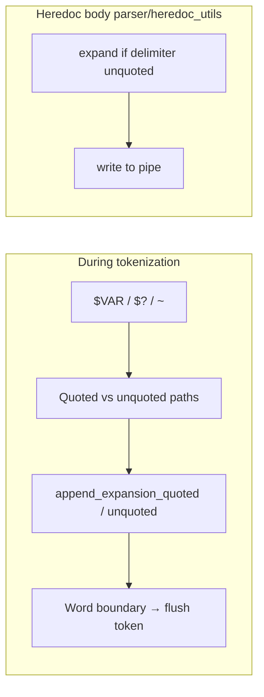

**Tilde `~`:** handled in **`handle_tilde_expansion()`** when not in heredoc mode (same tokenizer pass as **`$`**).

### 4.2 Variable Expansion Rules

| Input        | Context         | Result             | Explanation                |
| ------------ | --------------- | ------------------ | -------------------------- |
| `$HOME`      | Unquoted        | `/home/user`       | Normal expansion           |
| `"$HOME"`    | Double quotes   | `/home/user`       | Expansion works in ""      |
| `'$HOME'`    | Single quotes   | `$HOME`            | NO expansion in ''         |
| `$?`         | Any (except '') | `0` (or last exit) | Exit status                |
| `$UNDEFINED` | Any             | `` (empty)         | Unset → empty string       |
| `$`          | End of word     | `$`                | Literal $ (no var name)    |
| `$123`       | Any             | `$123`             | Invalid var name → literal |
| `"$"`        | Double quotes   | `$`                | Lone $ is literal          |

### 4.3 Variable Name Rules

```c
/* Valid variable name: starts with letter or _, followed by alnum or _ */
int is_valid_var_char(char c, int is_first)
{
    if (is_first)
        return (ft_isalpha(c) || c == '_');
    return (ft_isalnum(c) || c == '_');
}
```

### 4.4 Defensive Expansion Examples

```bash
# Test cases to verify your expander:

echo $HOME              # /home/user
echo "$HOME"            # /home/user
echo '$HOME'            # $HOME
echo $?                 # 0 (or last exit code)
echo "$?"               # 0
echo '$?'               # $?
echo $UNDEFINED         # (empty line)
echo "$UNDEFINED"       # (empty line)
echo $USER$HOME         # userhome (concatenated)
echo "$USER$HOME"       # user/home/user
echo $                  # $
echo "hello$"           # hello$
echo $123               # $123 (invalid var name)
echo $USER_NAME         # (value of USER_NAME, not USER + _NAME)
```

### 4.5 Verified by tests (expansion)

| Input / scenario | Expected | Test (phase1 / hardening) |
|------------------|----------|----------------------------|
| `echo $UNDEFINED` | Empty line | undefined var empty |
| `echo $` | `$` | dollar alone |
| `true` then `echo $?` | `0` | dollar question (success) |
| `false` then `echo $?` | `1` | dollar question (failure) |
| `echo $1` | Literal `$1` (no expand) | dollar digit no expand |
| `echo '$HOME'` | `$HOME` | var in single quotes |
| `export VAR=val` then `echo $VAR` | `val` | set and echo var (phase1 + hardening) |
| `echo "hello $VAR"` (VAR=world) | `hello world` | var in double quotes |
| `export X=xyz` then `unset X` then `echo $X` | Empty | unset var |
| `export A_B=1` then `echo $A_B` | `1` | var with underscore |
| `echo a$EMPTY b` | `a b` | empty var |
| `export A-B=x` | stderr "not a valid identifier" | invalid export |
| `echo $` at end of line | No crash | expansion at end |

Expansion runs during **tokenization** (see `tokenizer/expansion.c`, `tokenizer/expansion_utils.c`). Heredoc expansion is in `parser/heredoc_utils.c` (quoted delimiter → no expand). See [BEHAVIOR.md](BEHAVIOR.md) §4.

---

## 5. Parser (Command Table Construction)

### 5.1 Command Structure (actual: `includes/structs.h`)

```c
typedef struct s_arg
{
    char            *value;
    struct s_arg    *next;
}   t_arg;

typedef struct s_redir
{
    char            *file;
    int             fd;         /* Target stream: STDIN_FILENO, STDOUT_FILENO, or STDERR_FILENO */
    int             append;     /* 1 for >>; 0 for <, >, 2> */
    struct s_redir  *next;
}   t_redir;

typedef struct s_command
{
    t_arg               *args;          /* Linked list of args; finalize_argv → argv */
    char                **argv;         /* ["ls", "-la", NULL] for execve */
    t_redir             *redirs;        /* All redirections: < > >> << 2> (file, fd, append) */
    int                 heredoc_fd;     /* FD for heredoc input (or -1) */
    char                *heredoc_delim; /* Delimiter for heredoc */
    int                 heredoc_quoted; /* Flag if delimiter was quoted */
    int                 is_builtin;     /* Set in finalize_all_commands via get_builtin_type(argv[0]) */
    struct s_command    *next;          /* Next command in pipeline */
}   t_command;
```

- **Parser** fills `args` and `redirs`; **argv_build.c** `finalize_argv()` builds `argv`, then `finalize_all_commands()` sets `is_builtin`.

### 5.2 Parsing Flow (actual: `parser/parser.c`, `parser/add_token_to_cmd.c`)

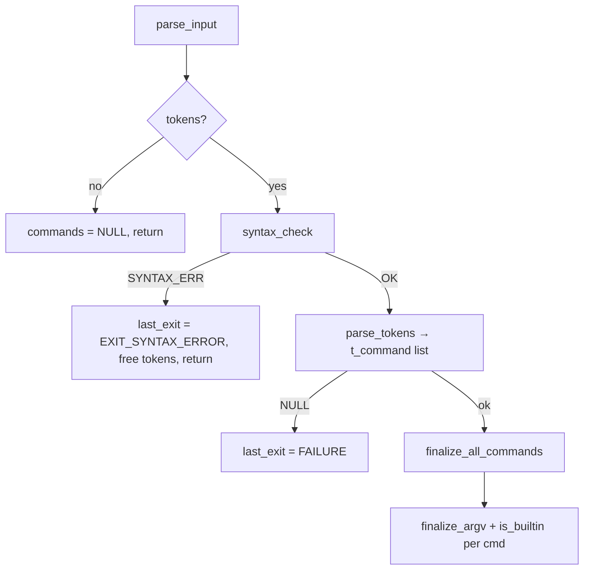

- **parser/parser.c**: **`parse_input()`** — **`syntax_check`** first; on success **`parse_tokens()`** walks tokens; each **`parse_token_step()`**: on **`PIPE`** append new **`t_command`**, else **`add_token_to_command()`** (WORD → **`add_word_to_cmd`**, redirs → **`append_redir`** / **`handle_heredoc_token`**).
- **parser/argv_build.c**: **`finalize_all_commands()`** → **`finalize_argv()`** (args list → **`argv[]`**), then **`get_builtin_type(cmd->argv[0]) != NOT_BUILTIN`** → **`cmd->is_builtin`**.

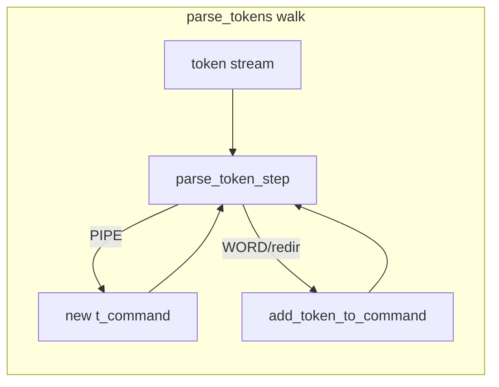

### 5.3 Redirection Parsing (Right-to-Left for Multiple)

```bash
# Bash behavior: Last redirection wins
$ echo hello > file1 > file2    # Creates both, writes to file2
$ cat < file1 < file2           # Opens both, reads from file2

# Our approach (simpler): Process left-to-right, last one wins
# This matches bash behavior for the final result
```

### 5.4 Builtin Detection

```c
typedef enum e_builtin
{
    NOT_BUILTIN = 0,
    BUILTIN_ECHO,
    BUILTIN_CD,
    BUILTIN_PWD,
    BUILTIN_EXPORT,
    BUILTIN_UNSET,
    BUILTIN_ENV,
    BUILTIN_EXIT,
    BUILTIN_COUNT
}   t_builtin;

/* t_builtin_reg { name, run } in structs.h; static tab inside builtin_registry() */
t_builtin   get_builtin_type(char *cmd);
int         run_builtin(char **argv, t_shell *shell);
```

---

## 6. Heredoc Handling

### 6.1 When to Process Heredocs

```
CRITICAL: Process ALL heredocs BEFORE forking for execution!

Why?
1. Heredoc reads from stdin (same as your prompt)
2. If you fork first, child and parent fight for stdin
3. Signals during heredoc need special handling
```

### 6.2 Heredoc Flow

```
Command: cat << EOF << END
                │
                ▼
┌──────────────────────────────────────────────────────────────┐
│  1. Find all HEREDOC tokens in command list                  │
└──────────────────────────────────────────────────────────────┘
                │
                ▼
┌──────────────────────────────────────────────────────────────┐
│  2. For each heredoc (left to right):                        │
│     a. pipe(); write lines to write end                      │
│     b. Read lines until delimiter                            │
│     c. Store read end in cmd->heredoc_fd                     │
└──────────────────────────────────────────────────────────────┘
                │
                ▼
┌──────────────────────────────────────────────────────────────┐
│  3. Last heredoc FD becomes stdin for command                │
└──────────────────────────────────────────────────────────────┘
```

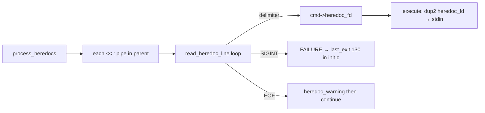

### 6.3 Heredoc + Signals

**Implementation:** `parser/heredoc.c` — static `read_heredoc_line()` uses `readline("> ")` on a TTY, else the same byte-by-byte pattern as `main.c` `read_line_stdin`. Loop checks `g_signum == SIGINT` after each line → close pipe ends, return `FAILURE` (`process_input` sets `last_exit = EXIT_SIGINT`). EOF without delimiter → `print_heredoc_eof_warning()` (see `heredoc_warning.c`).

### 6.4 Heredoc Expansion Rules

```bash
# Delimiter WITHOUT quotes: Expansion happens
cat << EOF
$HOME
EOF
# Output: /home/user

# Delimiter WITH quotes: No expansion (literal)
cat << 'EOF'
$HOME
EOF
# Output: $HOME

cat << "EOF"
$HOME
EOF
# Output: $HOME (same as single quotes for delimiter)
```

---

## 7. Executor (The Core Engine)

**Implementation:** `executor/executor.c` (`execute_commands`, static `run_empty_command` / `run_builtin_command`), `executor/executor_redir_apply.c` (`apply_redirections`), `executor/executor_external.c` (`execute_external`, `find_command_path`), `executor/executor_pip.c` + `executor/executor_pip_steps.c` (`run_pipe_step`, barrier-ready child setup), `executor/executor_pip_not_found.c`, `executor/executor_child_exec.c` (`execute_in_child`), `executor/executor_child_format.c` (`dprintf_cmd_not_found`).

### 7.1 Decision Tree (real code path)

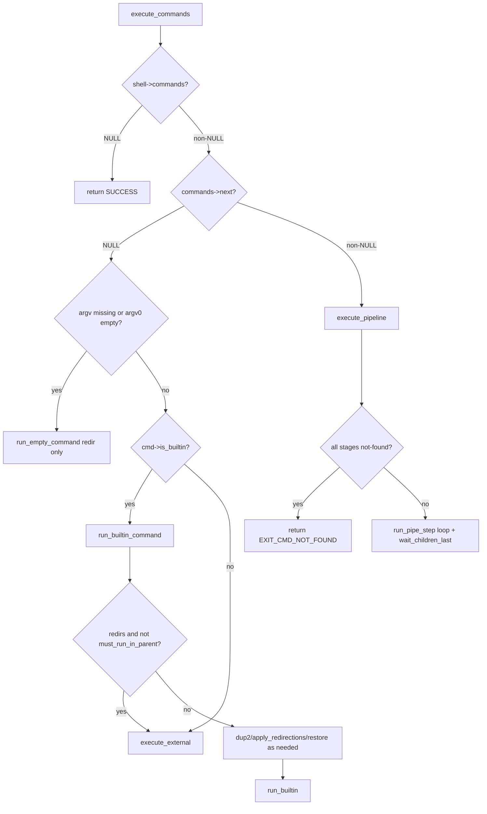

### 7.2 Single Command Execution

```
┌──────────────────────────────────────────────────────────────┐
│                   SINGLE COMMAND                             │
└──────────────────────────────────────────────────────────────┘
                          │
          ┌───────────────┴───────────────┐
          │     Is it a builtin?          │
          └───────────────┬───────────────┘
                          │
         ┌────────────────┼────────────────┐
         │                │                │
         ▼                ▼                ▼
  ┌─────────────┐  ┌─────────────┐  ┌─────────────┐
  │ cd/export/  │  │ echo/pwd/   │  │ External    │
  │ unset/exit  │  │ env         │  │ Binary      │
  │ (State-     │  │ (No-state   │  │ (ls, cat)   │
  │  changing)  │  │  builtin)   │  │             │
  └──────┬──────┘  └──────┬──────┘  └──────┬──────┘
         │                │                │
         ▼                ▼                ▼
  ┌─────────────┐  ┌─────────────┐  ┌─────────────┐
  │ RUN IN      │  │ Can run in  │  │ MUST fork   │
  │ PARENT      │  │ parent OR   │  │             │
  │ (no fork)   │  │ fork        │  │             │
  └─────────────┘  └─────────────┘  └─────────────┘
```

**Why run cd/export/unset/exit in parent?**

- `cd`: Must change parent's working directory
- `export`: Must modify parent's environment
- `unset`: Must modify parent's environment
- `exit`: Must exit the parent shell

**Note:** For a **single** command, state-changing builtins (`cd`, `export`, `unset`, `exit`) always run in the parent. Other builtins run in the parent **unless** the command has redirections/heredoc — then they go through `execute_external` (fork) like a simple command with redirs.

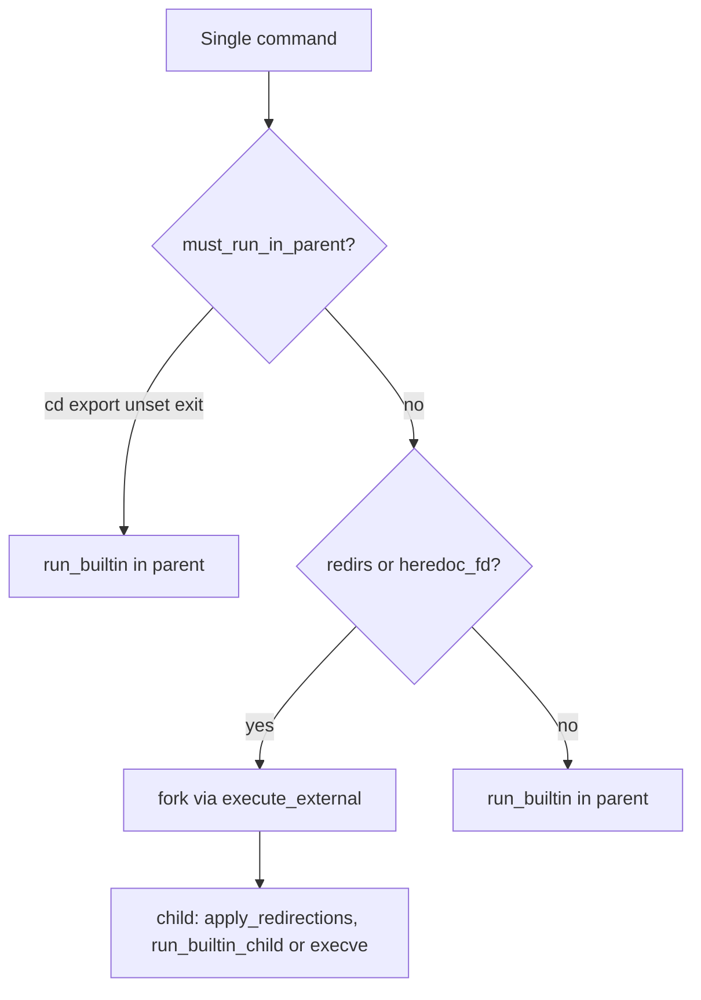

### 7.3 Single command (actual: `executor/executor.c`)

Redirections use static `backup_fds` / `restore_fds` only when `cmd->redirs` or `heredoc_fd` is set. Empty argv → `run_empty_command`. Builtin path → `run_builtin_command` (may delegate to `execute_external` if redirs + not `must_run_in_parent`). Else → `execute_external` → fork → child `apply_redirections` + `execute_in_child`.

### 7.4 Pipeline Execution

```
Command: ls -la | grep ".c" | wc -l

┌──────────────────────────────────────────────────────────────┐
│  PARENT PROCESS                                              │
│  ─────────────────────────────────────────────────────────── │
│  1. Count commands (3)                                       │
│  2. Create pipes: pipe1[2], pipe2[2]                         │
│  3. Fork child for each command                              │
│  4. Close ALL pipe ends in parent                            │
│  5. waitpid for all children                                 │
│  6. Get exit status from LAST child                          │
└──────────────────────────────────────────────────────────────┘
         │
         ├──────────────────┬──────────────────┐
         ▼                  ▼                  ▼
┌─────────────┐     ┌─────────────┐     ┌─────────────┐
│   CHILD 1   │     │   CHILD 2   │     │   CHILD 3   │
│   ls -la    │────▶│  grep ".c"  │────▶│   wc -l     │
│             │pipe1│             │pipe2│             │
│ stdout→pipe1│     │stdin←pipe1  │     │stdin←pipe2  │
│             │     │stdout→pipe2 │     │             │
└─────────────┘     └─────────────┘     └─────────────┘
```

**Verified by tests (executor / pipelines):** Single commands: Phase 1 + Hardening (builtins in parent, externals forked). Pipeline stdout: Hardening simple/two/five pipes, pipe with grep/wc -l, pipe builtin echo, pipe with spaces. Pipeline exit: `true | false` → 1, `false | true` → 0. Pipeline + redir and stress (long pipeline, many pipelines, pipe redir combo, export then pipe): no crash. Path: absolute path, command not found (`EXIT_CMD_NOT_FOUND`), directory as cmd (`EXIT_CMD_CANNOT_EXECUTE`). See [BEHAVIOR.md](BEHAVIOR.md) §3, §7.

### 7.5 Pipeline (actual: `executor_pip.c` + `executor_pip_steps.c`)

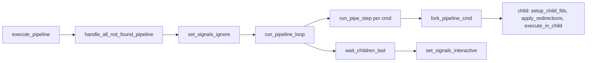

No `pids[]` array: parent tracks only `prev_fd` between steps; `waitpid(-1, …)` in `wait_children_last` reaps `n` children and returns the **last** segment’s status.

### 7.6 Command Execution (In Child) — actual: `executor_child_exec.c` `execute_in_child()`

```c
/* executor_child_exec.c — sketch */
void	execute_in_child(t_command *cmd, t_shell *shell)
{
	if (cmd->is_builtin)
		run_builtin_child(cmd, shell);
	if (!cmd->argv || !cmd->argv[0])
		clean_exit(shell, SUCCESS);
	path = find_command_path(cmd->argv[0], shell);
	if (!path)
		child_exit_not_found(shell, cmd->argv[0]); /* EXIT_CMD_NOT_FOUND */
	/* stat: is directory → EXIT_CMD_CANNOT_EXECUTE */
	execve(path, cmd->argv, shell->envp);
	/* ENOENT → EXIT_CMD_NOT_FOUND; else → EXIT_CMD_CANNOT_EXECUTE */
}
```

**Supporting files:**
- **`executor_child_format.c`**: `dprintf_cmd_not_found` — not-found line to stderr (`$'…'` when name has control bytes).
- **`executor_pip_not_found.c`**: `handle_all_not_found_pipeline` — if every stage is a simple missing-PATH external with no redirs/heredoc, print all errors in parent and caller returns **`EXIT_CMD_NOT_FOUND`** without forking children for that path.

### 7.7 Path Resolution (actual: `executor_external.c`)

`find_command_path` uses a **static** buffer (`PATH_MAX`): copy the return value before the next call if you need to keep it. If `cmd` contains `/`, the path is copied as-is (resolution happens at `execve`). Otherwise scan `PATH` colon-separated segments with `stat` (regular file), not `ft_split` + `access` as in older sketches. If `PATH` is missing but the shell **had** `PATH` at startup, a default list is used (`/usr/local/bin:/usr/bin:/bin:.`).

---

## 8. Exit Status Reference (Bash-Aligned)

All exit codes follow the [Bash Reference Manual](https://www.gnu.org/software/bash/manual/html_node/Exit-Status.html) and common shell conventions so that `$?` and scripted behavior match bash. **Verified by:** Phase 1 (exit 0/42/255, exit no args); Hardening §10, §11, §14, §17 (exit 256/257, -1, non-numeric, too many args; 127/126; pipeline last command). See [BEHAVIOR.md](BEHAVIOR.md) §6.

### 8.0 Named constants (`includes/defines.h`)

Use these in C instead of bare numbers: **`SUCCESS`** / **`FAILURE`** (0/1), **`EXIT_SYNTAX_ERROR`** (2), **`EXIT_CMD_CANNOT_EXECUTE`** (126), **`EXIT_CMD_NOT_FOUND`** (127), **`EXIT_STATUS_SIGNAL_BASE`** (128), **`EXIT_STATUS_FROM_SIGNAL(sig)`** (= 128 + signal number; pass **`WTERMSIG(status)`** from **`waitpid`**), **`EXIT_SIGINT`** (= **`EXIT_STATUS_FROM_SIGNAL(SIGINT)`**, usually 130). **`EXIT_SIGINT`** requires **`<signal.h>`** before **`defines.h`** — **`minishell.h`** includes **`includes.h`** first.

### 8.1 Summary Table

| Scenario                     | Exit Code      | Macro / expression (`defines.h`)        | Bash reference / usage                          |
| ---------------------------- | -------------- | ---------------------------------------- | ----------------------------------------------- |
| Command success              | `0`            | `SUCCESS`                                | Normal success                                  |
| Command general error        | `1`            | `FAILURE`                                | General failure; builtin "too many args" return |
| Syntax error (shell misuse)  | `2`            | `EXIT_SYNTAX_ERROR`                      | Misuse of shell builtin / syntax error           |
| Permission denied (exec)     | `126`          | `EXIT_CMD_CANNOT_EXECUTE`                | File found but not executable                    |
| Command not found            | `127`          | `EXIT_CMD_NOT_FOUND`                     | Command not in PATH                             |
| Fatal signal N              | `128 + N`      | `EXIT_STATUS_FROM_SIGNAL(N)`           | Child killed by signal N (e.g. 130 = SIGINT)     |
| Ctrl+C (SIGINT)              | `130`          | `EXIT_SIGINT`                            | `EXIT_STATUS_FROM_SIGNAL(SIGINT)`               |
| Ctrl+\ (SIGQUIT)             | `131`          | `EXIT_STATUS_FROM_SIGNAL(SIGQUIT)`       | `128 + 3`                                       |
| `exit` with valid arg        | `arg % 256`    | —                                        | 0–255; out-of-range wraps (e.g. 256 → 0)        |
| `exit` with non-numeric      | `255` (bash) / **`2` (this shell)** | `EXIT_SYNTAX_ERROR` (us) | Bash: stderr + exit 255. **We:** same message, **`EXIT_SYNTAX_ERROR`** (known difference). |
| `exit` with too many args    | (no exit)      | returns `FAILURE`                        | Print error to stderr, shell continues |

### 8.2 Where We Use Each Code

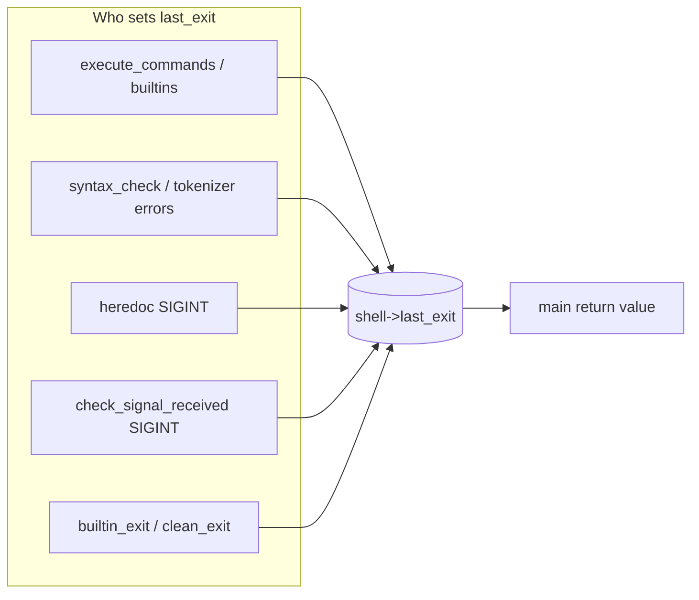

- **`SUCCESS` (0)** – Successful builtin or external command.
- **`FAILURE` (1)** – Builtin failure (e.g. `exit` too many args **returns** `FAILURE`), redirection failure, or generic error.
- **`EXIT_SYNTAX_ERROR` (2)** – Syntax error (`syntax_check`, tokenizer unclosed quote); also **`exit` with non-numeric arg** (bash uses **255**).
- **`EXIT_CMD_CANNOT_EXECUTE` (126)** – Path is directory or permission denied around `execve` (`executor_child_exec.c` `child_abort_cmd_error`).
- **`EXIT_CMD_NOT_FOUND` (127)** – Command not found (`child_exit_not_found`; pipeline fast path `handle_all_not_found_pipeline` in parent).
- **`EXIT_STATUS_FROM_SIGNAL(sig)`** – Child terminated by signal; e.g. **`EXIT_SIGINT`** (`executor_external.c` `get_child_status`, pipeline `wait_children_last`).

### 8.3 exit Builtin (Bash Reference)

- **Interactive only:** In an interactive shell, bash prints `"exit\n"` (or `"logout\n"` for login shells) to **stderr** before exiting (see `builtins/exit.def`). We do the same: `ft_putendl_fd("exit", STDERR_FILENO)` when `isatty(STDIN_FILENO)`.
- **Non-numeric argument:** Bash exits with **255** after printing "numeric argument required" to stderr. **We exit `EXIT_SYNTAX_ERROR`** (same message; exit code differs — see `exit.c`).
- **Too many arguments:** Bash does not exit; it prints an error and returns 1. We match this (**`FAILURE`**).

---

## 9. Built-in Commands (Detailed Specs)

### 9.1 echo [-n] [args...]

```bash
# Behavior:
echo hello world        # "hello world\n"
echo -n hello           # "hello" (no newline)
echo -n -n -n hello     # "hello" (multiple -n same as one)
echo -nnnnn hello       # "hello" (bash accepts this)
echo -n -a hello        # "-a hello\n" (-a not valid, stops -n parsing)
echo ""                 # "\n" (empty string = just newline)
echo                    # "\n" (no args = just newline)
echo -n                 # "" (nothing, not even newline)
```

### 9.2 cd [path]

```bash
# Behavior:
cd /tmp                 # Change to /tmp
cd                      # Change to $HOME
cd -                    # Change to $OLDPWD, print new path
cd ""                   # Error or no-op (bash: no error, stays)
cd nonexistent          # Error: "No such file or directory"

# Must update:
# - PWD environment variable
# - OLDPWD environment variable
# - shell->cwd
```

### 9.3 pwd

```bash
# Behavior:
pwd                     # Print current working directory
# No options needed
# Use getcwd() or shell->cwd
```

### 9.4 export [name[=value]...]

```bash
# Behavior:
export                  # Print all exported vars (sorted, with "declare -x")
export VAR=value        # Set and export
export VAR              # Mark existing var for export (or create empty)
export VAR=             # Set VAR to empty string
export 1VAR=x           # Error: not a valid identifier
export VAR=hello=world  # VAR = "hello=world" (only first = splits)
```

### 9.5 unset [name...]

```bash
# Behavior:
unset VAR               # Remove VAR from environment
unset VAR1 VAR2         # Remove multiple
unset NONEXISTENT       # No error (silent)
unset 1VAR              # Error: not a valid identifier
```

### 9.6 env

```bash
# Behavior:
env                     # Print all environment variables
# No options or arguments
# Only print vars that have been exported
```

### 9.7 exit [n]

Bash reference: message `"exit"` is printed to **stderr** in interactive mode only.

```bash
# Behavior (mostly bash; non-numeric uses EXIT_SYNTAX_ERROR / 2 here, bash uses 255):
exit                    # Exit with last command's status
exit 0                  # Exit with 0
exit 42                 # Exit with 42
exit 256                # Exit with 0 (256 % 256)
exit -1                 # Exit with 255 (two's complement)
exit abc                # Error to stderr: "numeric argument required", then EXIT_SYNTAX_ERROR (bash: 255)
exit 1 2 3              # Error to stderr: "too many arguments", return FAILURE / 1, do NOT exit
```

### 9.8 Verified by tests (builtins)

All builtin behaviors above are covered by **Phase 1** and **Hardening**:

| Builtin | Phase 1 tests | Hardening tests |
|---------|----------------|------------------|
| **echo** | echo basic, multiple words, -n flag, -n multiple, -nnnnn, no args, empty string, -n only, -n stops at invalid | echo basic, -n, -nnn, -n stops at non-flag, empty, empty string arg, single/double quotes |
| **pwd** | pwd basic | pwd, cd /tmp and pwd, cd HOME |
| **cd** | cd /tmp then pwd, cd HOME, cd nonexistent | cd /tmp and pwd, cd HOME, cd nonexistent, cd with extra args |
| **env** | env contains PATH/HOME/USER | env has PATH/HOME, export sets var then env, unset then env |
| **export** | export no args, export set var, export invalid name | export no args has declare, export sets var, export invalid name, export bad name exit 1 |
| **unset** | unset removes var | unset removes from env |
| **exit** | exit no args, exit 0/42/255 | exit 0/42/255, 256 wraps, no args, non-numeric, too many args no exit; exit -1, 257 wraps, too many args exit 1 |

See [BEHAVIOR.md](BEHAVIOR.md) §5 for input/output examples and exit codes.

---

## 10. Error Messages Format

```c
/* Standard error format (match bash style): */
ft_putstr_fd("minishell: ", 2);
ft_putstr_fd(context, 2);       /* e.g., "cd" or filename */
ft_putstr_fd(": ", 2);
ft_putstr_fd(error_msg, 2);     /* e.g., "No such file or directory" */
ft_putstr_fd("\n", 2);

/* Examples: */
"minishell: cd: /nonexistent: No such file or directory"
"minishell: syntax error near unexpected token `|'"
"minishell: export: `1invalid': not a valid identifier"
"minishell: ./script: Permission denied"
"minishell: nosuchcmd: command not found"
```

---

## 11. Memory Management & Cleanup

### 11.1 Per-Loop Cleanup (actual: `free/free_shell.c`)

```c
void	reset_shell(t_shell *shell)
{
	if (shell->tokens)
		free_tokens(shell->tokens);
	shell->tokens = NULL;
	if (shell->commands)
		free_commands(shell->commands);
	shell->commands = NULL;
	if (shell->input)
		free(shell->input);
	shell->input = NULL;
}
```

**Does not** clear **`envp`**, **`user`**, **`cwd`**, or **`last_exit`** (see **§2**).

### 11.2 Exit Cleanup (actual: `free/free_shell.c`)

```c
void	free_all(t_shell *shell)
{
	if (shell->tokens)
		free_tokens(shell->tokens);
	shell->tokens = NULL;
	if (shell->commands)
		free_commands(shell->commands);
	shell->commands = NULL;
	if (shell->envp)
		free_envp(shell->envp);
	shell->envp = NULL;
	if (shell->user)
		free(shell->user);
	shell->user = NULL;
	if (shell->cwd)
		free(shell->cwd);
	shell->cwd = NULL;
	if (shell->input)
		free(shell->input);
	shell->input = NULL;
}
```

**`main()`** calls **`rl_clear_history()`** before **`free_all()`**; **`builtin_exit`** → **`clean_exit`** → **`free_all`** on shell exit.

### 11.3 Defensive pattern

Call sites **NULL** out pointers after freeing (as in **`reset_shell`** / **`free_all`**) so double-free paths are easier to spot. There is **no** shared **`safe_free`** helper in this repo—the pattern is applied **inline**.

---

## 12. Testing Checklist

Covered by **[LeaYeh/42_minishell_tester](https://github.com/LeaYeh/42_minishell_tester)** (e.g. `./scripts/run_minishell_tester.sh m`). See [BEHAVIOR.md](BEHAVIOR.md) for expected behavior and test-design guidance.

### 12.1 Basic Commands

- [x] `ls`, `cat`, `echo`, `pwd` work
- [x] Commands with arguments work
- [x] Absolute paths work: `/bin/ls`
- [x] Relative paths work: `./minishell`

### 12.2 Builtins

- [x] `echo` with and without `-n`
- [x] `cd` with path, no args, `-`
- [x] `pwd` prints correct directory
- [x] `export` shows and sets variables
- [x] `unset` removes variables
- [x] `env` shows environment
- [x] `exit` with and without code

### 12.3 Redirections

- [x] `< file` reads from file
- [x] `> file` writes to file (creates/truncates)
- [x] `>> file` appends to file
- [x] `<< EOF` heredoc works
- [x] Multiple redirections work

### 12.4 Pipes

- [x] `ls | cat` works
- [x] `ls | cat | wc` works
- [x] `cat | cat | cat` works
- [x] Pipes with builtins work

### 12.5 Expansion

- [x] `$HOME` expands correctly
- [x] `$?` expands to exit code
- [x] `"$VAR"` expands in double quotes
- [x] `'$VAR'` does NOT expand
- [x] `$UNDEFINED` becomes empty

### 12.6 Signals

- [x] Ctrl+C shows new prompt
- [x] Ctrl+D exits shell
- [x] Ctrl+\ does nothing in prompt
- [x] Ctrl+C during `cat` kills cat

### 12.7 Edge Cases

- [x] Empty input (just Enter)
- [x] Only spaces/tabs
- [x] Unclosed quotes rejected with syntax error (no continuation)
- [x] Invalid pipe syntax error
- [x] Non-existent command error

---

## 13. Implementation Order (Current Status)

Reflects the **built** codebase; phase1 + hardening tests pass.

```
Phase 1: Foundation
├── [x] Shell struct and initialization (core/init.c, structs.h)
├── [x] Main loop with readline (TTY) / read_line_stdin (non-TTY) (src/main.c)
├── [x] Basic signal handling (signals/signal_handler.c, signal_utils.c)
└── [x] Builtins (echo, cd, pwd, export, unset, env, exit)

Phase 2: Lexer & Parser
├── [x] Tokenizer (tokenizer/tokenizer.c, tokenizer_ops.c, tokenizer_handlers.c, tokenizer_quotes.c)
├── [x] Quote handling (unclosed quote -> syntax error, no continuation)
├── [x] Syntax validation (parser/parser_syntax_check.c)
└── [x] Command table construction (parser/parser.c, add_token_to_cmd.c, argv_build.c)

Phase 3: Expander
├── [x] Variable expansion (tokenizer/expansion.c, tokenizer/expansion_utils.c — $VAR, $?)
├── [x] Exit status expansion ($?)
├── [x] Quote removal (during tokenization)
└── [x] Edge case handling (e.g. $ at end, invalid names)

Phase 4: Executor (Simple)
├── [x] Single external command execution (executor/executor_external.c)
├── [x] Path resolution (find_command_path in executor_external.c)
├── [x] Single builtin with redirections (run_builtin_command / execute_external, apply_redirections)
└── [x] File redirections (executor/executor_redir_apply.c, apply_one_redir, heredoc_fd)

Phase 5: Pipes & Heredoc
├── [x] Pipeline execution (executor/executor_pip.c)
├── [x] Heredoc implementation (parser/heredoc.c, parser/heredoc_utils.c)
├── [x] Multiple redirections (cmd->redirs list, left-to-right)
└── [x] Signal handling in children (wait_children_last, `EXIT_STATUS_FROM_SIGNAL`)

Phase 6: Polish & Refactor
├── [x] Error messages (minishell: cmd: msg style)
├── [x] Memory cleanup (free/free_shell.c, free/free_runtime.c, reset_shell)
├── [x] Edge case handling (hardening tests pass)
├── [x] Executor split: child_exec, child_format, pipeline_steps, pipeline_not_found
├── [x] Exit utils extracted: parse_exit_value in exit_utils.c
├── [x] Pipeline barrier for stderr ordering (barrier_write_fd in t_shell)
└── [ ] Norminette / 42 compliance (project-specific)
```

---

## 14. Related documentation

| Document | Purpose |
|----------|---------|
| **[BEHAVIOR.md](BEHAVIOR.md)** | Test-backed behavior: redirections, pipes, expansion, builtins, exit codes, path resolution, input resilience. Use for evaluation and debugging. |
| **[DATA_MODEL_AND_FUNCTIONS.md](DATA_MODEL_AND_FUNCTIONS.md)** | **Data model:** why we chose each struct/enum. **Function reference:** every function by file with one-line description; Mermaid call flow. |
| **[`includes/defines.h`](../includes/defines.h)** | Shared macros: **`SUCCESS`/`FAILURE`**, **`EXIT_SYNTAX_ERROR`**, **`EXIT_CMD_*`**, **`EXIT_STATUS_FROM_SIGNAL`**, **`EXIT_SIGINT`**, lexer/parser sentinels. |
| **README.md** | Project overview, build, usage, how to run tests. |
