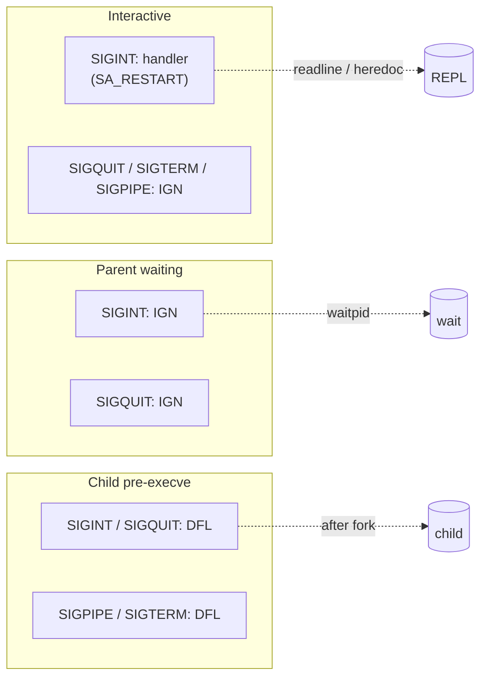
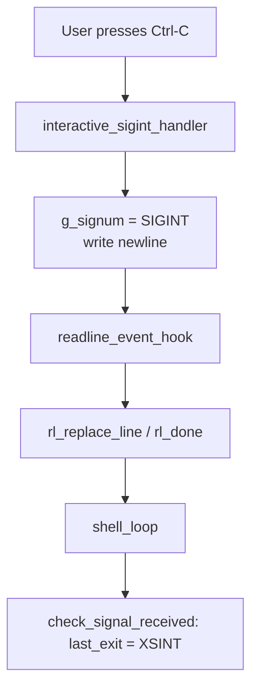

# Signals in minishell

This note describes how this shell uses **one global** (`g_signum`, allowed by the subject), **`sigaction`**, and three **disposition layers** so the parent stays usable while children behave like normal foreground processes.

---

## Vocabulary

| Symbol / API | Role |
|--------------|------|
| `volatile sig_atomic_t g_signum` | Async-safe flag: set to `SIGINT` in the interactive handler; cleared in `check_signal_received`. |
| `set_signals_interactive()` | REPL / heredoc input: custom `SIGINT` (with `SA_RESTART`), ignore `SIGQUIT`, `SIGTERM`, `SIGPIPE`. |
| `set_signals_ignore()` | Parent while `waitpid`: ignore `SIGINT` and `SIGQUIT` so only children react. |
| `set_signals_default()` | Child before `execve`: restore default handling for `SIGINT`, `SIGQUIT`, `SIGPIPE`, `SIGTERM`. |
| `readline_event_hook` | If `g_signum == SIGINT`, clears the line and sets `rl_done` so readline stops this read. |
| `check_signal_received` | If `g_signum == SIGINT`, sets `shell->last_exit` to **`XSINT` (130)** and clears `g_signum`. |
| `XSINT` / `XSB` | `130` = `128 + SIGINT`; signal exits use **`XSB + signal number`** (see `defines.h`). |

---

## When each mode applies



---

## Lifecycle: one external command

```mermaid
sequenceDiagram
  participant Loop as shell_loop
  participant Sig as signal masks
  participant Par as parent
  participant Ch as child

  Loop->>Sig: set_signals_interactive
  Note over Loop: readline / process_input
  Par->>Sig: set_signals_ignore
  Par->>Ch: fork
  Ch->>Sig: set_signals_default
  Ch->>Ch: execve
  Par->>Par: waitpid (EINTR retried)
  Par->>Sig: set_signals_interactive
  Note over Par: child_wait_st → last_exit
```

---

## REPL and Ctrl-C at the prompt

After **`SIGINT`**, the handler writes a newline and sets **`g_signum`**. The readline hook clears the visible line and ends the current read. The main loop calls **`check_signal_received`** so **`$?` becomes 130** before the next prompt. **`SA_RESTART`** on `SIGINT` lets interrupted `read()` calls restart; **`g_signum`** still records the interrupt and is observed after the syscall returns (heredoc / non-TTY stdin paths).



---

## Scenario checklist

1. **Ctrl-C at the prompt** — Handler sets `g_signum`, hook ends readline’s current read; **`check_signal_received`** sets **`last_exit = 130`**; loop continues with a fresh prompt.

2. **Ctrl-C during a single external command** — Parent has **`SIGINT` ignored**; the child gets default **`SIGINT`** and dies by signal. **`child_wait_st`** maps the status to **`XSB + WTERMSIG`** (for **`SIGINT`**, **130**). Parent restores interactive masks after **`waitpid`**.

3. **Ctrl-\\ (`SIGQUIT`) during a child** — Child gets default (core dump if configured). **`run_external`** uses **`child_wait_st`**, which prints **`Quit (core dumped)\n`** to stderr when the terminating signal is **`SIGQUIT`**, and returns **131** (`XSB + SIGQUIT`). **Pipelines** use **`wait_pipes`**, which records the same numeric status for the **last segment** but **does not** print that message.

4. **Ctrl-C during heredoc** — Same interactive **`SIGINT`** handler as the prompt. **`heredoc_read_one`** sees **`g_signum == SIGINT`**, calls **`heredoc_interrupted`** (closes pipe fds), and **`process_input`** sets **`last_exit = XSINT`**. The next loop iteration clears the flag via **`check_signal_received`**.

5. **Ctrl-C during a pipeline** — **`set_signals_ignore()`** runs before **`spawn_pipes()`**; the parent does not terminate on **`SIGINT`** while waiting. Children receive **`SIGINT`** directly; **`wait_pipes`** reaps all **`N`** children and **`run_pip`** returns the **last segment’s** exit status (including **`128 + signal`** if that segment was signaled).

6. **Ctrl-C during a parent-side builtin** (`cd`, `export`, `exit`, …) — Builtin runs in the parent with **interactive** signals, so **`g_signum`** may be set; **`check_signal_received`** at the start of the next loop iteration sets **`$?` to 130** if the interrupt was not otherwise consumed.

7. **`SA_RESTART` and `read()`** — **`SIGINT`** is installed with **`SA_RESTART`**. Slow `read()` calls can restart after the handler runs; **`g_signum`** remains set until **`check_signal_received`** or heredoc interrupt logic runs, so the signal is not “lost.”

---

## Disposition matrix

| Context | SIGINT | SIGQUIT | SIGTERM | SIGPIPE |
|--------|--------|---------|---------|---------|
| Prompt / readline | Custom handler (`g_signum`, newline), **`SA_RESTART`** | Ignored | Ignored | Ignored |
| Parent waiting for child | Ignored | Ignored | Not changed by ignore helper; interactive mode had ignored TERM/PIPE | Not changed by ignore helper; interactive mode ignored PIPE |
| Child before `execve` | Default | Default | Default | Default |
| Heredoc line read | Same as interactive (still in parent) | Ignored | Ignored | Ignored |

---

## Code map

| Area | Files |
|------|--------|
| Handlers and `sigaction` | `src/signals/signal_handler.c` |
| Readline hook and `check_signal_received` | `src/signals/signal_utils.c` |
| REPL loop | `src/core/shell_repl.c` |
| Heredoc interrupt | `src/parser/heredoc_collect.c`, `process_input` in `src/core/init.c` |
| External wait + `child_wait_st` | `src/executor/exec_external.c` |
| Pipeline wait | `src/executor/exec_pipeline.c` |

For exit-code naming and aliases, see **`includes/defines.h`** and **`docs/BEHAVIOR.md`**.
