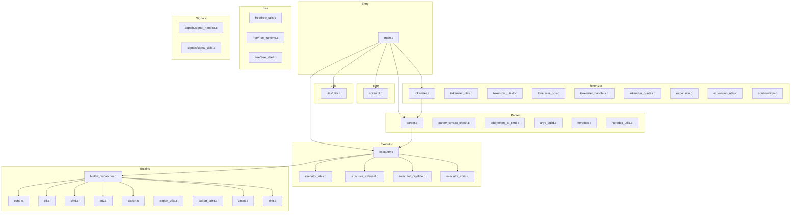
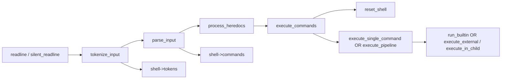
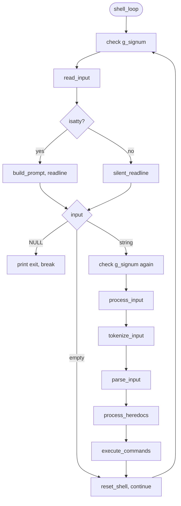
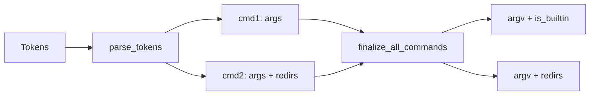
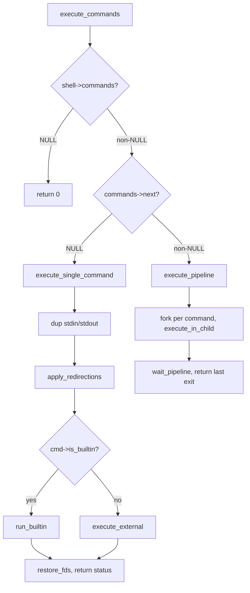

# Minishell Project Architecture (Defensive Programming)

> **Philosophy:** Defensive programming means we validate every input, handle every error case explicitly, and never assume success. We use bash as our reference implementation but only implement what the 42 subject requires.
>
> **Test-backed behavior:** The test suite is **42_minishell_tester** (mandatory). For expected behavior per input, exit codes, and test-design guidance, see **[BEHAVIOR.md](BEHAVIOR.md)**.

---

## 0. Project Status & Built Implementation

This section reflects the **actual codebase** as built: source layout, data flow, and test status.

### 0.1 Test Status (as of last run)

| Suite | Description | Status |
|-------|-------------|--------|
| 42_minishell_tester (mandatory) | `make -C tests test` runs [42_minishell_tester](https://github.com/cozyGarage/42_minishell_tester) mandatory | ✅ |

Run from repo root: `make -C tests test`.

### 0.2 Test coverage map (what the suite verifies)

Behavior described in this document and in [BEHAVIOR.md](BEHAVIOR.md) is backed by **42_minishell_tester**’s files and **tests/local_tests** :

| Area | Coverage |
|------|----------|
| **Echo** | 1_builtins.sh — echo, -n, quotes, $?, backslash escaping |
| **PWD / CD** | 1_builtins.sh — pwd, cd, cd -, extra args ignored |
| **Env / Export / Unset** | 1_builtins.sh — env, export, unset, invalid names |
| **Exit** | 1_builtins.sh — exit 0/42/255/256/257, non-numeric, too many args |
| **Expansion** | 0_compare_parsing.sh, 1_builtins.sh, 1_variables.sh — $VAR, $?, quotes |
| **Redirections** | 1_redirs.sh — >, >>, <, <<, combined, missing file |
| **Pipes** | 1_pipelines.sh — pipelines, heredocs in pipes |
| **Syntax** | 8_syntax_errors.sh — \|, \| \|, >, >>, <<, invalid tokens |
| **Path / 127 / 126** | 1_scmds.sh, 2_path_check.sh, 9_go_wild.sh |
| **Parsing** | 0_compare_parsing.sh, 10_parsing_hell.sh |

### 0.3 Source Layout (real files)



### 0.4 Pipeline: Input → Execution (real flow)



- **main.c**: `shell_loop` → `read_input` → `process_input` (tokenize → parse → heredocs → execute) → `reset_shell`.
- **Tokenizer**: `tokenize_input()` in `tokenizer.c`; uses `tokenizer_handlers.c`, `tokenizer_quotes.c`, `expansion.c`, `tokenizer_ops.c`, `continuation.c`.
- **Parser**: `parse_input()` in `parser.c`; `syntax_check()` in `parser_syntax_check.c`; `finalize_all_commands()` in `argv_build.c` builds `argv` and sets `is_builtin`.
- **Executor**: `execute_commands()` in `executor.c`; single command → `execute_single_command()` (builtin in parent, external forked); pipeline → `execute_pipeline()` in `executor_pipeline.c`; children run `execute_in_child()` in `executor_child.c`.

---

## 1. Global State & Signal Handling

### 1.1 The Global Variable Rule

```c
/* ONLY global variable allowed in the entire project */
volatile sig_atomic_t	g_signum = 0;
```

| Value        | Meaning         | Action Required                                    |
| ------------ | --------------- | -------------------------------------------------- |
| `0`          | No signal       | Continue normally                                  |
| `SIGINT (2)` | Ctrl+C received | Print newline, new prompt, set `exit_status = 130` |

**Critical Rules:**

- ❌ Do NOT store structs, pointers, or flags in global
- ❌ Do NOT access `t_shell` from signal handler
- ✅ Only store the signal NUMBER
- ✅ Check `g_signum` in main loop AFTER `readline()` returns

**Why `volatile sig_atomic_t`?**

- `volatile`: Tells compiler the value can change at any time (by signal handler)
- `sig_atomic_t`: Guaranteed atomic read/write (no partial updates)

### 1.2 Signal Behavior (Bash Reference)

| Signal             | Interactive Mode     | During Execution                  | During Heredoc                     |
| ------------------ | -------------------- | --------------------------------- | ---------------------------------- |
| `SIGINT` (Ctrl+C)  | New prompt, `$?=130` | Kill child, new prompt            | Stop heredoc, new prompt, `$?=130` |
| `SIGQUIT` (Ctrl+\) | Ignored              | Kill child + "Quit (core dumped)" | Ignored                            |
| `EOF` (Ctrl+D)     | Exit shell           | N/A (not a signal)                | Close heredoc input                |

**Implementation Pattern:**

```c
/* In main loop, AFTER readline returns */
if (g_signum == SIGINT)
{
    shell->last_exit = 130;
    g_signum = 0;  /* Reset for next iteration */
}
```

### 1.3 Initialization (actual implementation)

**Current `init_shell()` behavior** (see `src/core/init.c`):

```
init_shell(t_shell *shell, char **envp)
├── 1. Caller must zero the struct first: ft_bzero(shell, sizeof(t_shell)) (done in main)
├── 2. shell->envp = ft_arrdup(envp); exit(1) if NULL
├── 3. shell->user = ft_strdup(get_env_value(shell->envp, "USER"))
├── 4. shell->cwd = getcwd(NULL, 0); if NULL → shell->cwd = ft_strdup("/")
├── 5. shell->last_exit = 0
├── 6. shell->tokens = NULL, shell->commands = NULL, shell->input = NULL
└── Signal handlers are set in main() after init: set_signals_interactive()
```

**Note:** The code does not currently create a minimal env when `envp` is NULL, nor does it increment `SHLVL`. Those are optional improvements for full bash compatibility; see [BEHAVIOR.md](BEHAVIOR.md) for what is implemented.

---

## 2. Main Loop (REPL Cycle)

**Implementation:** `main.c` → `shell_loop()` → `read_input()` → `process_input()`.



| Step | Code / behavior |
|------|------------------|
| 1 | `check_signal_received(shell)` — if SIGINT, set `last_exit=130`, reset `g_signum`. |
| 2 | `read_input()`: if TTY → `build_prompt()`, `readline(prompt)`; else `silent_readline()` (stdout to `/dev/null` during read). |
| 3 | NULL → print `"exit"`, break; empty → skip processing; else continue. |
| 4 | Check `g_signum` again (e.g. Ctrl+C during readline). |
| 5 | Non-empty input is added to history inside `tokenize_input()` (before `free(shell->input)`). |
| 6 | `process_input()`: tokenize → parse → heredocs → execute. |
| 7 | `reset_shell(shell)` frees tokens, commands, input. |

---

## 3. Lexer (Tokenization)

### 3.1 Token Types (Matching Your structs.h)

```c
typedef enum e_tokentype
{
    WORD,       /* Commands, arguments, filenames */
    PIPE,       /* | */
    REDIR_IN,   /* < */
    REDIR_OUT,  /* > */
    APPEND,     /* >> */
    HEREDOC     /* << */
}   t_tokentype;
```

### 3.2 Lexer State Machine

```
Input: echo "hello world" | cat < file.txt

State: NORMAL
        │
        ├── Whitespace → Skip
        ├── Quote (' or ") → Enter QUOTED state
        ├── | → Emit PIPE token
        ├── < → Check next char
        │       ├── < → Emit HEREDOC
        │       └── else → Emit REDIR_IN
        ├── > → Check next char
        │       ├── > → Emit APPEND
        │       └── else → Emit REDIR_OUT
        └── Other → Accumulate into WORD

State: SINGLE_QUOTED (')
        └── Everything is literal until closing '

State: DOUBLE_QUOTED (")
        ├── $ → Mark for expansion (but still in WORD)
        └── Everything else literal until closing "
```

### 3.3 Syntax Error Detection (Defensive Checks)

**Error: Unclosed Quotes**

```bash
$ echo "hello        # bash: unexpected EOF while looking for matching `"'
$ echo 'hello        # bash: unexpected EOF while looking for matching `''
```

**Our behavior:** Print error, set `last_exit = 2`, do NOT execute.

**Error: Invalid Pipe Usage**

```bash
$ | ls              # bash: syntax error near unexpected token `|'
$ ls |              # bash: syntax error near unexpected token `newline'
$ ls || cat         # We don't handle || (logical OR) - treat as syntax error
$ ls | | cat        # bash: syntax error near unexpected token `|'
```

**Our behavior:** Print `minishell: syntax error near unexpected token`, set `last_exit = 2`.

**Error: Invalid Redirection**

```bash
$ ls >              # bash: syntax error near unexpected token `newline'
$ ls > > file       # bash: syntax error near unexpected token `>'
$ ls < >            # bash: syntax error near unexpected token `>'
```

### 3.4 Syntax Validation (actual: `parser_syntax_check.c`)

```c
/* syntax_check() returns SYNTAX_ERR; syntax_error() prints message and sets last_exit */
int	syntax_check(t_token *tokens)
{
    t_token *curr = tokens;
    t_token *prev = NULL;

    while (curr)
    {
        /* Rule 1: Pipe cannot be first or last */
        if (curr->type == PIPE && (prev == NULL || curr->next == NULL))
            return (syntax_error("|"));

        /* Rule 2: Pipe cannot follow pipe */
        if (curr->type == PIPE && prev && prev->type == PIPE)
            return (syntax_error("|"));

        /* Rule 3: Redirection must be followed by WORD */
        if (is_redirection(curr->type) &&
            (curr->next == NULL || curr->next->type != WORD))
            return (syntax_error(get_token_str(curr->type)));

        /* Rule 4: Redirection cannot follow redirection directly */
        if (is_redirection(curr->type) && prev && is_redirection(prev->type))
            return (syntax_error(get_token_str(curr->type)));

        prev = curr;
        curr = curr->next;
    }
    return (0);  /* Valid */
}
```

### 3.5 Verified by tests (lexer + syntax)

The following behaviors are verified by **Hardening** (no crash + correct exit / message):

| Input | Expected | Test name (hardening) |
|-------|----------|------------------------|
| `"` (empty) | No crash, exit 0 | empty string |
| `   ` (spaces) | No crash, exit 0 | spaces only |
| `|` | Syntax error, exit 2 | lone pipe |
| `||` | Syntax error, exit 2 | double pipe |
| `echo hi |` (pipe last) | Syntax error, exit 2 | pipe at end |
| `echo "hello` (unclosed) | No crash | unclosed double quote |
| `echo hi >` | Syntax error, exit 2 | redir no file, syntax redir no file |
| `>` | Syntax error, exit 2 | only redir token |
| pipe first (e.g. `| echo hi`) | stderr contains "syntax" | syntax pipe first |
| pipe last (e.g. `echo hi |`) | stderr contains "syntax" | syntax pipe last |

See [BEHAVIOR.md](BEHAVIOR.md) §1 for the full input-resilience table.

---

## 4. Expansion (Variable Substitution)

### 4.1 Expansion Order (Critical!)

```
┌──────────────────────────────────────────────────────────────┐
│  STEP 1: Variable Expansion ($VAR, $?)                       │
│  ─────────────────────────────────────────────────────────── │
│  • Happens INSIDE double quotes: "$HOME" → "/home/user"      │
│  • Does NOT happen inside single quotes: '$HOME' → "$HOME"   │
│  • Unset variable → empty string: $UNDEFINED → ""            │
└──────────────────────────────────────────────────────────────┘
                            │
                            ▼
┌──────────────────────────────────────────────────────────────┐
│  STEP 2: Quote Removal                                       │
│  ─────────────────────────────────────────────────────────── │
│  • "hello" → hello                                           │
│  • 'world' → world                                           │
│  • "hello"'world' → helloworld (concatenation)               │
└──────────────────────────────────────────────────────────────┘
                            │
                            ▼
┌──────────────────────────────────────────────────────────────┐
│  STEP 3: Word Splitting (We DON'T implement this fully)      │
│  ─────────────────────────────────────────────────────────── │
│  • Bash splits unquoted expansions by IFS                    │
│  • We keep it simple: expanded value stays as ONE argument   │
│  • This is acceptable for 42 subject scope                   │
└──────────────────────────────────────────────────────────────┘
```

### 4.2 Variable Expansion Rules

| Input        | Context         | Result             | Explanation                |
| ------------ | --------------- | ------------------ | -------------------------- |
| `$HOME`      | Unquoted        | `/home/user`       | Normal expansion           |
| `"$HOME"`    | Double quotes   | `/home/user`       | Expansion works in ""      |
| `'$HOME'`    | Single quotes   | `$HOME`            | NO expansion in ''         |
| `$?`         | Any (except '') | `0` (or last exit) | Exit status                |
| `$UNDEFINED` | Any             | `` (empty)         | Unset → empty string       |
| `$`          | End of word     | `$`                | Literal $ (no var name)    |
| `$123`       | Any             | `$123`             | Invalid var name → literal |
| `"$"`        | Double quotes   | `$`                | Lone $ is literal          |

### 4.3 Variable Name Rules

```c
/* Valid variable name: starts with letter or _, followed by alnum or _ */
int is_valid_var_char(char c, int is_first)
{
    if (is_first)
        return (ft_isalpha(c) || c == '_');
    return (ft_isalnum(c) || c == '_');
}
```

### 4.4 Defensive Expansion Examples

```bash
# Test cases to verify your expander:

echo $HOME              # /home/user
echo "$HOME"            # /home/user
echo '$HOME'            # $HOME
echo $?                 # 0 (or last exit code)
echo "$?"               # 0
echo '$?'               # $?
echo $UNDEFINED         # (empty line)
echo "$UNDEFINED"       # (empty line)
echo $USER$HOME         # userhome (concatenated)
echo "$USER$HOME"       # user/home/user
echo $                  # $
echo "hello$"           # hello$
echo $123               # $123 (invalid var name)
echo $USER_NAME         # (value of USER_NAME, not USER + _NAME)
```

### 4.5 Verified by tests (expansion)

| Input / scenario | Expected | Test (phase1 / hardening) |
|------------------|----------|----------------------------|
| `echo $UNDEFINED` | Empty line | undefined var empty |
| `echo $` | `$` | dollar alone |
| `true` then `echo $?` | `0` | dollar question (success) |
| `false` then `echo $?` | `1` | dollar question (failure) |
| `echo $1` | Literal `$1` (no expand) | dollar digit no expand |
| `echo '$HOME'` | `$HOME` | var in single quotes |
| `export VAR=val` then `echo $VAR` | `val` | set and echo var (phase1 + hardening) |
| `echo "hello $VAR"` (VAR=world) | `hello world` | var in double quotes |
| `export X=xyz` then `unset X` then `echo $X` | Empty | unset var |
| `export A_B=1` then `echo $A_B` | `1` | var with underscore |
| `echo a$EMPTY b` | `a b` | empty var |
| `export A-B=x` | stderr "not a valid identifier" | invalid export |
| `echo $` at end of line | No crash | expansion at end |

Expansion runs during **tokenization** (see `expansion.c`, `expansion_utils.c`). Heredoc expansion is in `heredoc_utils.c` (quoted delimiter → no expand). See [BEHAVIOR.md](BEHAVIOR.md) §4.

---

## 5. Parser (Command Table Construction)

### 5.1 Command Structure (actual: `includes/structs.h`)

```c
typedef struct s_arg
{
    char            *value;
    struct s_arg    *next;
}   t_arg;

typedef struct s_redir
{
    char            *file;
    int             is_input;   /* 1 for < or <<, 0 for > or >> */
    int             append;     /* 1 for >> */
    struct s_redir  *next;
}   t_redir;

typedef struct s_command
{
    t_arg               *args;          /* Linked list of args; finalize_argv → argv */
    char                **argv;         /* ["ls", "-la", NULL] for execve */
    t_redir             *redirs;        /* All redirections: < > >> << (file, is_input, append) */
    int                 heredoc_fd;     /* FD for heredoc input (or -1) */
    char                *heredoc_delim; /* Delimiter for heredoc */
    int                 heredoc_quoted; /* Flag if delimiter was quoted */
    int                 is_builtin;     /* Set in finalize_all_commands via is_builtin(argv[0]) */
    struct s_command    *next;          /* Next command in pipeline */
}   t_command;
```

- **Parser** fills `args` and `redirs`; **argv_build.c** `finalize_argv()` builds `argv`, then `finalize_all_commands()` sets `is_builtin`.

### 5.2 Parsing Flow (actual: `parser.c`, `add_token_to_cmd.c`)



- **parser.c**: `parse_tokens()` walks tokens; on `PIPE` creates new command, else `consume_command_tokens()` → `add_token_to_command()` (WORD → `add_word_to_cmd`, redirs → `append_redir` / `handle_heredoc_token`).
- **argv_build.c**: `finalize_all_commands()` → `finalize_argv()` (args list → `argv[]`), then `is_builtin(cmd->argv[0])` → `cmd->is_builtin`.

### 5.3 Redirection Parsing (Right-to-Left for Multiple)

```bash
# Bash behavior: Last redirection wins
$ echo hello > file1 > file2    # Creates both, writes to file2
$ cat < file1 < file2           # Opens both, reads from file2

# Our approach (simpler): Process left-to-right, last one wins
# This matches bash behavior for the final result
```

### 5.4 Builtin Detection

```c
typedef enum e_builtin
{
    NOT_BUILTIN = 0,
    BUILTIN_ECHO,
    BUILTIN_CD,
    BUILTIN_PWD,
    BUILTIN_EXPORT,
    BUILTIN_UNSET,
    BUILTIN_ENV,
    BUILTIN_EXIT
}   t_builtin;

t_builtin   get_builtin_type(char *cmd)
{
    if (!cmd)
        return (NOT_BUILTIN);
    if (ft_strcmp(cmd, "echo") == 0)
        return (BUILTIN_ECHO);
    if (ft_strcmp(cmd, "cd") == 0)
        return (BUILTIN_CD);
    /* ... etc ... */
    return (NOT_BUILTIN);
}
```

---

## 6. Heredoc Handling

### 6.1 When to Process Heredocs

```
CRITICAL: Process ALL heredocs BEFORE forking for execution!

Why?
1. Heredoc reads from stdin (same as your prompt)
2. If you fork first, child and parent fight for stdin
3. Signals during heredoc need special handling
```

### 6.2 Heredoc Flow

```
Command: cat << EOF << END
                │
                ▼
┌──────────────────────────────────────────────────────────────┐
│  1. Find all HEREDOC tokens in command list                  │
└──────────────────────────────────────────────────────────────┘
                │
                ▼
┌──────────────────────────────────────────────────────────────┐
│  2. For each heredoc (left to right):                        │
│     a. Create temp file or pipe                              │
│     b. Read lines until delimiter                            │
│     c. Write to temp file/pipe                               │
│     d. Store FD in command struct                            │
└──────────────────────────────────────────────────────────────┘
                │
                ▼
┌──────────────────────────────────────────────────────────────┐
│  3. Last heredoc FD becomes stdin for command                │
└──────────────────────────────────────────────────────────────┘
```

### 6.3 Heredoc + Signals

```c
/* During heredoc input, Ctrl+C should: */
/* 1. Stop reading heredoc */
/* 2. NOT execute the command */
/* 3. Return to prompt with exit status 130 */

char *read_heredoc_line(char *delimiter)
{
    char *line;

    line = readline("> ");

    /* Check for Ctrl+C */
    if (g_signum == SIGINT)
    {
        free(line);
        return (NULL);  /* Signal to stop heredoc */
    }

    /* Check for Ctrl+D (EOF) */
    if (line == NULL)
    {
        /* Bash warning: here-document delimited by end-of-file */
        ft_putstr_fd("minishell: warning: here-document delimited by EOF\n", 2);
        return (NULL);
    }

    return (line);
}
```

### 6.4 Heredoc Expansion Rules

```bash
# Delimiter WITHOUT quotes: Expansion happens
cat << EOF
$HOME
EOF
# Output: /home/user

# Delimiter WITH quotes: No expansion (literal)
cat << 'EOF'
$HOME
EOF
# Output: $HOME

cat << "EOF"
$HOME
EOF
# Output: $HOME (same as single quotes for delimiter)
```

---

## 7. Executor (The Core Engine)

**Implementation:** `executor.c` (`execute_commands`), `executor_utils.c` (redirections, `execute_builtin`), `executor_external.c`, `executor_pipeline.c`, `executor_child.c`.

### 7.1 Decision Tree (real code path)



### 7.2 Single Command Execution

```
┌──────────────────────────────────────────────────────────────┐
│                   SINGLE COMMAND                             │
└──────────────────────────────────────────────────────────────┘
                          │
          ┌───────────────┴───────────────┐
          │     Is it a builtin?          │
          └───────────────┬───────────────┘
                          │
         ┌────────────────┼────────────────┐
         │                │                │
         ▼                ▼                ▼
  ┌─────────────┐  ┌─────────────┐  ┌─────────────┐
  │ cd/export/  │  │ echo/pwd/   │  │ External    │
  │ unset/exit  │  │ env         │  │ Binary      │
  │ (State-     │  │ (No-state   │  │ (ls, cat)   │
  │  changing)  │  │  builtin)   │  │             │
  └──────┬──────┘  └──────┬──────┘  └──────┬──────┘
         │                │                │
         ▼                ▼                ▼
  ┌─────────────┐  ┌─────────────┐  ┌─────────────┐
  │ RUN IN      │  │ Can run in  │  │ MUST fork   │
  │ PARENT      │  │ parent OR   │  │             │
  │ (no fork)   │  │ fork        │  │             │
  └─────────────┘  └─────────────┘  └─────────────┘
```

**Why run cd/export/unset/exit in parent?**

- `cd`: Must change parent's working directory
- `export`: Must modify parent's environment
- `unset`: Must modify parent's environment
- `exit`: Must exit the parent shell

**Simplification for 42:** Run ALL builtins in parent for single commands. It's easier and matches bash behavior.

### 7.3 Single Command with Redirections (actual: `executor.c`)

```c
/* executor.c: execute_single_command() */
int execute_single_command(t_command *cmd, t_shell *shell)
{
    int stdin_backup = dup(STDIN_FILENO);
    int stdout_backup = dup(STDOUT_FILENO);
    int status;

    if (apply_redirections(cmd))  /* executor_utils.c; returns 1 on failure */
    {
        restore_fds(stdin_backup, stdout_backup);
        return (1);
    }
    if (!cmd->argv || !cmd->argv[0])
    {
        restore_fds(stdin_backup, stdout_backup);
        return (0);
    }
    if (cmd->is_builtin)
        status = execute_builtin(cmd, shell);   /* → run_builtin(cmd->argv, shell) */
    else
        status = execute_external(cmd, shell);   /* fork + execute_in_child */
    restore_fds(stdin_backup, stdout_backup);
    return (status);
}
```

### 7.4 Pipeline Execution

```
Command: ls -la | grep ".c" | wc -l

┌──────────────────────────────────────────────────────────────┐
│  PARENT PROCESS                                              │
│  ─────────────────────────────────────────────────────────── │
│  1. Count commands (3)                                       │
│  2. Create pipes: pipe1[2], pipe2[2]                         │
│  3. Fork child for each command                              │
│  4. Close ALL pipe ends in parent                            │
│  5. waitpid for all children                                 │
│  6. Get exit status from LAST child                          │
└──────────────────────────────────────────────────────────────┘
         │
         ├──────────────────┬──────────────────┐
         ▼                  ▼                  ▼
┌─────────────┐     ┌─────────────┐     ┌─────────────┐
│   CHILD 1   │     │   CHILD 2   │     │   CHILD 3   │
│   ls -la    │────▶│  grep ".c"  │────▶│   wc -l     │
│             │pipe1│             │pipe2│             │
│ stdout→pipe1│     │stdin←pipe1  │     │stdin←pipe2  │
│             │     │stdout→pipe2 │     │             │
└─────────────┘     └─────────────┘     └─────────────┘
```

**Verified by tests (executor / pipelines):** Single commands: Phase 1 + Hardening (builtins in parent, externals forked). Pipeline stdout: Hardening simple/two/five pipes, pipe with grep/wc -l, pipe builtin echo, pipe with spaces. Pipeline exit: `true | false` → 1, `false | true` → 0. Pipeline + redir and stress (long pipeline, many pipelines, pipe redir combo, export then pipe): no crash. Path: absolute path, command not found (127), directory as cmd (126). See [BEHAVIOR.md](BEHAVIOR.md) §3, §7.

### 7.5 Pipeline Code Pattern

```c
void execute_pipeline(t_command *cmds, t_shell *shell)
{
    int     pipe_fd[2];
    int     prev_fd = -1;  /* Read end of previous pipe */
    pid_t   *pids;
    int     i = 0;
    t_command *cmd = cmds;

    pids = malloc(sizeof(pid_t) * count_commands(cmds));

    while (cmd)
    {
        /* Create pipe if not last command */
        if (cmd->next)
            pipe(pipe_fd);

        pids[i] = fork();
        if (pids[i] == 0)
        {
            /* CHILD */
            /* Setup input from previous pipe */
            if (prev_fd != -1)
            {
                dup2(prev_fd, STDIN_FILENO);
                close(prev_fd);
            }
            /* Setup output to next pipe */
            if (cmd->next)
            {
                close(pipe_fd[0]);  /* Close read end */
                dup2(pipe_fd[1], STDOUT_FILENO);
                close(pipe_fd[1]);
            }
            /* Apply file redirections (override pipe if present) */
            apply_redirections(cmd);
            /* Execute */
            execute_command(cmd, shell);
            exit(shell->last_exit);
        }

        /* PARENT */
        if (prev_fd != -1)
            close(prev_fd);
        if (cmd->next)
        {
            close(pipe_fd[1]);  /* Close write end */
            prev_fd = pipe_fd[0];  /* Save read end for next iteration */
        }

        cmd = cmd->next;
        i++;
    }

    /* Wait for all children */
    wait_for_children(pids, i, shell);
    free(pids);
}
```

### 7.6 Command Execution (In Child) — actual: `executor_child.c` `execute_in_child()`

```c
/* executor_child.c */
void execute_in_child(t_command *cmd, t_shell *shell)
{
    char *path;

    if (cmd->is_builtin)
        exit(run_builtin(cmd->argv, shell));
    if (!cmd->argv || !cmd->argv[0])
        exit(0);
    path = find_command_path(cmd->argv[0], shell);  /* executor_external.c */
    if (!path)
        cmd_not_found(cmd->argv[0]);   /* stderr + exit(127) */
    check_is_dir(cmd->argv[0], path);  /* exit(126) if directory */
    execve(path, cmd->argv, shell->envp);
    handle_exec_error(cmd->argv[0], path);
}
```

### 7.7 Path Resolution

```c
char *find_command_path(char *cmd, t_shell *shell)
{
    char    *path_env;
    char    **paths;
    char    *full_path;
    int     i;

    /* Case 1: Command contains slash (absolute or relative path) */
    if (ft_strchr(cmd, '/'))
    {
        if (access(cmd, X_OK) == 0)
            return (ft_strdup(cmd));
        return (NULL);
    }

    /* Case 2: Search in PATH */
    path_env = get_env_value(shell->envp, "PATH");
    if (!path_env)
        return (NULL);  /* No PATH = can't find command */

    paths = ft_split(path_env, ':');
    i = 0;
    while (paths[i])
    {
        full_path = join_path(paths[i], cmd);  /* "dir" + "/" + "cmd" */
        if (access(full_path, X_OK) == 0)
        {
            free_array(paths);
            return (full_path);
        }
        free(full_path);
        i++;
    }
    free_array(paths);
    return (NULL);
}
```

---

## 8. Exit Status Reference (Bash-Aligned)

All exit codes follow the [Bash Reference Manual](https://www.gnu.org/software/bash/manual/html_node/Exit-Status.html) and common shell conventions so that `$?` and scripted behavior match bash. **Verified by:** Phase 1 (exit 0/42/255, exit no args); Hardening §10, §11, §14, §17 (exit 256/257, -1, non-numeric, too many args; 127/126; pipeline last command). See [BEHAVIOR.md](BEHAVIOR.md) §6.

### 8.1 Summary Table

| Scenario                     | Exit Code      | Bash reference / usage                          |
| ---------------------------- | -------------- | ----------------------------------------------- |
| Command success              | `0`            | Normal success                                  |
| Command general error        | `1`            | General failure; builtin "too many args" return |
| Syntax error (shell misuse)  | `2`            | Misuse of shell builtin / syntax error           |
| Permission denied (exec)     | `126`          | File found but not executable                    |
| Command not found            | `127`          | Command not in PATH                             |
| Fatal signal N              | `128 + N`      | Child killed by signal N (e.g. 130 = SIGINT)     |
| Ctrl+C (SIGINT)              | `130`          | `128 + 2`                                       |
| Ctrl+\ (SIGQUIT)             | `131`          | `128 + 3`                                       |
| `exit` with valid arg        | `arg % 256`    | 0–255; out-of-range wraps (e.g. 256 → 0)        |
| `exit` with non-numeric      | `255`          | Print "numeric argument required" to stderr, exit 255 |
| `exit` with too many args    | (no exit)      | Print error to stderr, return 1, shell continues |

### 8.2 Where We Use Each Code

- **0** – Successful builtin or external command.
- **1** – Builtin failure (e.g. `exit 1 2`), redirection failure, or generic error.
- **2** – Syntax error (`syntax_check`). Also: `exit` with too many args **returns** 1 (shell keeps running; we do not exit).
- **126** – `execve` not attempted or failed: path is directory or not executable (`executor_child.c`).
- **127** – Command not found (`executor_child.c`).
- **128 + signal** – Child terminated by signal; e.g. **130** = SIGINT, **131** = SIGQUIT (`handle_child_exit`, `executor.c`, `executor_external.c`).
- **255** – `exit <non-numeric>`: print error to stderr then **exit(255)** (`builtin_exit`).

### 8.3 exit Builtin (Bash Reference)

- **Interactive only:** In an interactive shell, bash prints `"exit\n"` (or `"logout\n"` for login shells) to **stderr** before exiting (see `builtins/exit.def`). We do the same: `ft_putendl_fd("exit", STDERR_FILENO)` when `isatty(STDIN_FILENO)`.
- **Non-numeric argument:** Bash exits with **255** after printing "numeric argument required" to stderr. We match this.
- **Too many arguments:** Bash does not exit; it prints an error and returns 1. We match this.

---

## 9. Built-in Commands (Detailed Specs)

### 9.1 echo [-n] [args...]

```bash
# Behavior:
echo hello world        # "hello world\n"
echo -n hello           # "hello" (no newline)
echo -n -n -n hello     # "hello" (multiple -n same as one)
echo -nnnnn hello       # "hello" (bash accepts this)
echo -n -a hello        # "-a hello\n" (-a not valid, stops -n parsing)
echo ""                 # "\n" (empty string = just newline)
echo                    # "\n" (no args = just newline)
echo -n                 # "" (nothing, not even newline)
```

### 9.2 cd [path]

```bash
# Behavior:
cd /tmp                 # Change to /tmp
cd                      # Change to $HOME
cd -                    # Change to $OLDPWD, print new path
cd ""                   # Error or no-op (bash: no error, stays)
cd nonexistent          # Error: "No such file or directory"

# Must update:
# - PWD environment variable
# - OLDPWD environment variable
# - shell->cwd
```

### 9.3 pwd

```bash
# Behavior:
pwd                     # Print current working directory
# No options needed
# Use getcwd() or shell->cwd
```

### 9.4 export [name[=value]...]

```bash
# Behavior:
export                  # Print all exported vars (sorted, with "declare -x")
export VAR=value        # Set and export
export VAR              # Mark existing var for export (or create empty)
export VAR=             # Set VAR to empty string
export 1VAR=x           # Error: not a valid identifier
export VAR=hello=world  # VAR = "hello=world" (only first = splits)
```

### 9.5 unset [name...]

```bash
# Behavior:
unset VAR               # Remove VAR from environment
unset VAR1 VAR2         # Remove multiple
unset NONEXISTENT       # No error (silent)
unset 1VAR              # Error: not a valid identifier
```

### 9.6 env

```bash
# Behavior:
env                     # Print all environment variables
# No options or arguments
# Only print vars that have been exported
```

### 9.7 exit [n]

Bash reference: message `"exit"` is printed to **stderr** in interactive mode only.

```bash
# Behavior (exit codes match bash):
exit                    # Exit with last command's status
exit 0                  # Exit with 0
exit 42                 # Exit with 42
exit 256                # Exit with 0 (256 % 256)
exit -1                 # Exit with 255 (two's complement)
exit abc                # Error to stderr: "numeric argument required", then exit 255
exit 1 2 3              # Error to stderr: "too many arguments", return 1, do NOT exit
```

### 9.8 Verified by tests (builtins)

All builtin behaviors above are covered by **Phase 1** and **Hardening**:

| Builtin | Phase 1 tests | Hardening tests |
|---------|----------------|------------------|
| **echo** | echo basic, multiple words, -n flag, -n multiple, -nnnnn, no args, empty string, -n only, -n stops at invalid | echo basic, -n, -nnn, -n stops at non-flag, empty, empty string arg, single/double quotes |
| **pwd** | pwd basic | pwd, cd /tmp and pwd, cd HOME |
| **cd** | cd /tmp then pwd, cd HOME, cd nonexistent | cd /tmp and pwd, cd HOME, cd nonexistent, cd with extra args |
| **env** | env contains PATH/HOME/USER | env has PATH/HOME, export sets var then env, unset then env |
| **export** | export no args, export set var, export invalid name | export no args has declare, export sets var, export invalid name, export bad name exit 1 |
| **unset** | unset removes var | unset removes from env |
| **exit** | exit no args, exit 0/42/255 | exit 0/42/255, 256 wraps, no args, non-numeric, too many args no exit; exit -1, 257 wraps, too many args exit 1 |

See [BEHAVIOR.md](BEHAVIOR.md) §5 for input/output examples and exit codes.

---

## 10. Error Messages Format

```c
/* Standard error format (match bash style): */
ft_putstr_fd("minishell: ", 2);
ft_putstr_fd(context, 2);       /* e.g., "cd" or filename */
ft_putstr_fd(": ", 2);
ft_putstr_fd(error_msg, 2);     /* e.g., "No such file or directory" */
ft_putstr_fd("\n", 2);

/* Examples: */
"minishell: cd: /nonexistent: No such file or directory"
"minishell: syntax error near unexpected token `|'"
"minishell: export: `1invalid': not a valid identifier"
"minishell: ./script: Permission denied"
"minishell: nosuchcmd: command not found"
```

---

## 11. Memory Management & Cleanup

### 11.1 Per-Loop Cleanup (actual: `free/free_shell.c`)

```c
void reset_shell(t_shell *shell)
{
    free(shell->input);
    shell->input = NULL;
    free_tokens(shell->tokens);
    shell->tokens = NULL;
    free_commands(shell->commands);
    shell->commands = NULL;
}
```

### 11.2 Exit Cleanup (actual: `free/free_shell.c`)

```c
/* free/free_shell.c: free_all() — used at process exit (e.g. from builtin_exit) */
void free_all(t_shell *shell)
{
    free_tokens(shell->tokens);
    free_commands(shell->commands);
    free_envp(shell->envp);
    free(shell->user);
    free(shell->cwd);
    free(shell->input);
    /* rl_clear_history() is called in builtin_exit before free_all */
}
```

### 11.3 Defensive Free Pattern

```c
void safe_free(void **ptr)
{
    if (ptr && *ptr)
    {
        free(*ptr);
        *ptr = NULL;
    }
}
```

---

## 12. Testing Checklist

Covered by **42_minishell_tester** (`make -C tests test`). See [BEHAVIOR.md](BEHAVIOR.md) for expected behavior and test-design guidance.

### 12.1 Basic Commands

- [x] `ls`, `cat`, `echo`, `pwd` work
- [x] Commands with arguments work
- [x] Absolute paths work: `/bin/ls`
- [x] Relative paths work: `./minishell`

### 12.2 Builtins

- [x] `echo` with and without `-n`
- [x] `cd` with path, no args, `-`
- [x] `pwd` prints correct directory
- [x] `export` shows and sets variables
- [x] `unset` removes variables
- [x] `env` shows environment
- [x] `exit` with and without code

### 12.3 Redirections

- [x] `< file` reads from file
- [x] `> file` writes to file (creates/truncates)
- [x] `>> file` appends to file
- [x] `<< EOF` heredoc works
- [x] Multiple redirections work

### 12.4 Pipes

- [x] `ls | cat` works
- [x] `ls | cat | wc` works
- [x] `cat | cat | cat` works
- [x] Pipes with builtins work

### 12.5 Expansion

- [x] `$HOME` expands correctly
- [x] `$?` expands to exit code
- [x] `"$VAR"` expands in double quotes
- [x] `'$VAR'` does NOT expand
- [x] `$UNDEFINED` becomes empty

### 12.6 Signals

- [x] Ctrl+C shows new prompt
- [x] Ctrl+D exits shell
- [x] Ctrl+\ does nothing in prompt
- [x] Ctrl+C during `cat` kills cat

### 12.7 Edge Cases

- [x] Empty input (just Enter)
- [x] Only spaces/tabs
- [x] Unclosed quotes (continuation or no crash)
- [x] Invalid pipe syntax error
- [x] Non-existent command error

---

## 13. Implementation Order (Current Status)

Reflects the **built** codebase; phase1 + hardening tests pass.

```
Phase 1: Foundation
├── [x] Shell struct and initialization (core/init.c, structs.h)
├── [x] Main loop with readline (main.c, silent_readline for non-TTY)
├── [x] Basic signal handling (signals/signal_handler.c, signal_utils.c)
└── [x] Builtins (echo, cd, pwd, export, unset, env, exit)

Phase 2: Lexer & Parser
├── [x] Tokenizer (tokenizer.c, tokenizer_ops.c, tokenizer_handlers.c, tokenizer_quotes.c)
├── [x] Quote handling (continuation.c for unclosed quotes)
├── [x] Syntax validation (parser_syntax_check.c)
└── [x] Command table construction (parser.c, add_token_to_cmd.c, argv_build.c)

Phase 3: Expander
├── [x] Variable expansion (expansion.c, expansion_utils.c — $VAR, $?)
├── [x] Exit status expansion ($?)
├── [x] Quote removal (during tokenization)
└── [x] Edge case handling (e.g. $ at end, invalid names)

Phase 4: Executor (Simple)
├── [x] Single external command execution (executor_external.c)
├── [x] Path resolution (find_command_path in executor_external.c)
├── [x] Single builtin with redirections (execute_single_command, apply_redirections)
└── [x] File redirections (executor_utils.c, apply_one_redir, heredoc_fd)

Phase 5: Pipes & Heredoc
├── [x] Pipeline execution (executor_pipeline.c)
├── [x] Heredoc implementation (heredoc.c, heredoc_utils.c)
├── [x] Multiple redirections (cmd->redirs list, left-to-right)
└── [x] Signal handling in children (wait_pipeline, exit codes 128+N)

Phase 6: Polish
├── [x] Error messages (minishell: cmd: msg style)
├── [x] Memory cleanup (free/free_shell.c, free/free_runtime.c, reset_shell)
├── [x] Edge case handling (hardening tests pass)
└── [ ] Norminette / 42 compliance (project-specific)
```

---

## 14. Related documentation

| Document | Purpose |
|----------|---------|
| **[BEHAVIOR.md](BEHAVIOR.md)** | Test-backed behavior: redirections, pipes, expansion, builtins, exit codes, path resolution, input resilience. Use for evaluation and debugging. |
| **[DATA_MODEL_AND_FUNCTIONS.md](DATA_MODEL_AND_FUNCTIONS.md)** | **Data model:** why we chose each struct/enum. **Function reference:** every function by file with one-line description; Mermaid call flow. |
| **[TECHNICAL_DECISIONS.md](TECHNICAL_DECISIONS.md)** | Record of what we changed and why: data, functions, defensive/bug prevention, 42 constraints. For team and code review. |
| **README.md** | Project overview, build, usage, how to run tests. |
